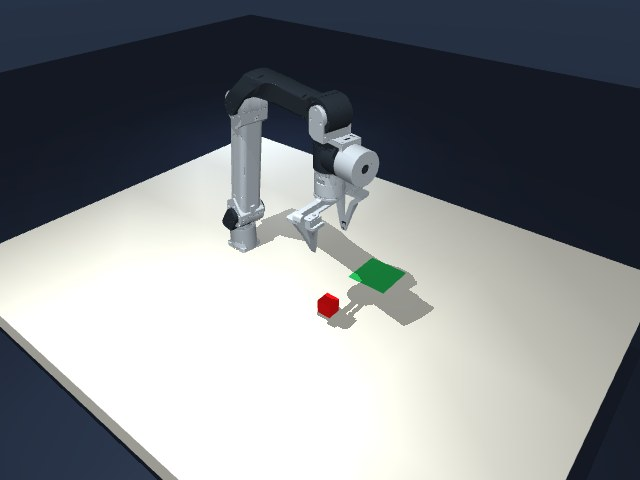

# ManiLoop

[English](README.md) · **[简体中文](README.zh-CN.md)**

一个基于 MuJoCo 的机器人操作测试框架，让 GPT 和学习策略通过视觉反馈控制机械臂，并记录可回看的完整实验。

[项目网站](https://daniel-rmc.github.io/ManiLoop/) · [交互工作台](https://daniel-rmc.github.io/ManiLoop/playground/?lang=zh) · [观看成功演示](https://daniel-rmc.github.io/ManiLoop/#demo) · [模型实测结果](docs/RESULTS.md)



## 可以做什么

- **让 GPT 闭环控制机器人。** 模型读取外部和腕部相机，选择受限动作，执行后重新观察。支持 Codex ChatGPT 登录和兼容的 Responses API。
- **测试本地模型。** 通过独立的 LeRobot 进程运行 SmolVLA、ACT、Diffusion Policy 检查点，支持 CPU、Apple MPS 和 CUDA。
- **选择仿真环境。** 使用内置的 ARX X5、Franka Panda 桌面场景，或安装保留原始 Panda 控制器、初始化和成功判定的官方 LIBERO 任务。
- **检查每次决策。** 网页提供手动调试、单步、暂停／继续、动作前后视觉上下文和离线决策回看。
- **保存完整 episode。** 记录每个 LIBERO 控制步的画面，导出双相机 MP4；命令行实验同时保存动作、观测、配置和独立评分。

策略输入只包含相机观测和机器人传感状态。物体真值、仿真接触列表、奖励和成功信号与策略输入隔离。独立评分可以读取仿真状态，并由调度器据此终止 episode。

## 成功演示

[观看 GPT-6 Astra 完成 LIBERO 黑碗任务 →](https://daniel-rmc.github.io/ManiLoop/#demo)

GPT-6 从官方初始化开始，在一次完整尝试中经过 **46 次决策、706 个控制步**，触发官方成功判定。视频保留了同一次尝试中的抓取失败、调整与重试：**707 组双相机画面，20 fps，35.35 秒**。视频按仿真时间播放，省略模型回复之间的等待。

官方成功在最后一次下降动作中触发，环境随即停止，没有额外验证松爪和退离。这是一条实际任务成功记录，不能据此估计整个基准的成功率。详见[实测结果与判定说明](docs/RESULTS.md)。

## 安装并打开仿真器

使用 **Python 3.12**，在仓库根目录执行命令。渲染需要可用的 OpenGL 上下文；调用云端 GPT 不需要本地 GPU 或模型权重。基础安装不需要 ROS、Docker 或实体机械臂。

### macOS / Linux

```bash
git clone https://github.com/Daniel-rmc/ManiLoop.git
cd ManiLoop
python3.12 -m venv .venv
source .venv/bin/activate
python -m pip install -r requirements.txt
python -m maniloop demo
```

### Windows PowerShell

```powershell
git clone https://github.com/Daniel-rmc/ManiLoop.git
cd ManiLoop
py -3.12 -m venv .venv
.\.venv\Scripts\python.exe -m pip install -r requirements.txt
.\.venv\Scripts\python.exe -m maniloop demo
```

后续 Windows 命令中的 `python` 请替换为 `.\.venv\Scripts\python.exe`。其余多行示例使用 Bash 语法，在 PowerShell 中请合并为一行执行；无需运行激活脚本或修改执行策略。

打开 [http://127.0.0.1:8765](http://127.0.0.1:8765)。连接模型前，可以先选择机器人和任务、移动机械臂、开合夹爪、重置场景。保持终端运行；按 `Ctrl+C` 关闭服务。服务仅监听本机地址。

无显示器的 Ubuntu/Debian 可安装 `libosmesa6`，并在启动 Python 前设置 `MUJOCO_GL=osmesa`。已有兼容 GPU 驱动时也可使用 EGL。这些是 Linux 设置，不适用于 macOS。

## 在 LIBERO 中运行 GPT

LIBERO 使用独立的 Python 3.10 环境，与 Python 3.12 主程序分开安装：

```bash
python -m pip install uv
python scripts/setup_libero.py
python -m maniloop list --backend libero
python -m maniloop smoke --backend libero
```

安装器需要 Git 和网络，会下载由项目管理的 Python、固定版本 LIBERO 源码及资源，无需下载 VLA 权重或示范数据集。Windows 未激活环境时，请显式指定已经安装的 `uv`：

```powershell
.\.venv\Scripts\python.exe -m pip install uv
.\.venv\Scripts\python.exe scripts/setup_libero.py --uv .\.venv\Scripts\uv.exe
```

使用账户登录时，安装近期官方 [Codex CLI](https://github.com/openai/codex)，执行 `codex login`，然后启动网页：

```bash
python -m maniloop demo --backend libero --codex-login --port 8767
```

打开 [http://127.0.0.1:8767](http://127.0.0.1:8767)，选择 Codex 来源、加载任务，再使用单步或连续执行。认证由 Codex 管理，ManiLoop 不提取登录 token。如果安装了多个 CLI 版本，可用 `MANILOOP_CODEX_BIN` 指定所需程序。

也可以在网页选择 API 供应商，填写基础地址、模型 ID 和 API Key，或导入 TOML 配置。机器人控制要求服务通过 Responses API 支持图像输入和 JSON Schema 输出。模型请求使用所选账户额度或供应商计费；打开网页不会自动开始推理。

录制一条 GPT-6 完整尝试：

```bash
python -m maniloop benchmark \
  --backend libero --libero-suite libero_spatial --libero-task-id 0 \
  --init-state-id 0 --seed 0 --agent llm_cloud --codex-login \
  --model gpt-6-astra --context-mode paired --reasoning-effort medium \
  --max-calls 0 --max-wall-seconds 3600 --record-episode \
  --output runs/gpt-demo
```

`--max-calls 0` 取消决策次数上限，官方环境终止、仿真时长和墙钟预算仍生效。默认 `controlled` 模式在模型推理期间暂停物理。重新运行不保证复现展示视频中的结果。

任务选择、连接诊断、相机配置和控制设置见 [LIBERO 使用说明](docs/LIBERO.md)与 [GPT 操作说明](docs/GPT6_DEMO.md)。

## 测试本地模型

安装 LIBERO 后，将支持的检查点下载到独立推理环境：

```bash
python scripts/setup_vla.py --models smolvla-libero act-libero diffusion-libero
python -m maniloop benchmark --backend libero --agent lerobot \
  --local-model smolvla-libero --max-calls 500 \
  --max-sim-seconds 25 --max-wall-seconds 1800
```

安装时省略 `--models` 则只下载 SmolVLA。Windows 用户可按前述方式加上 `--uv .\.venv\Scripts\uv.exe`。在网页选择本地 LeRobot 来源与已下载的模型即可运行。SmolVLA 接收语言指令；所选 ACT 和 Diffusion 检查点只使用图像和机器人状态，不以语言为条件。

| 环境 | 用途 |
| --- | --- |
| `.venv` · Python 3.12 | ManiLoop、网页、模型连接和内置 MuJoCo 场景 |
| `.venv-libero` · Python 3.10 | 官方 LIBERO 仿真及其固定依赖 |
| `.venv-vla` · Python 3.12 | LeRobot 与学习策略推理 |

三个环境保持隔离。模型检查点单独下载，不包含在仓库中。详见[本地模型安装与来源](docs/VLA.md)。

### 模型实测结果

每行选取 `libero_spatial` 的 task 0、init 0、seed 0 上的**一次运行**。

| 模型 | 官方结果 | 控制步数 | GPT 请求／本地模型推理次数 | 仿真时间 |
| --- | --- | ---: | ---: | ---: |
| GPT-6 Astra | 成功 | 706 | 46 | 35.30 秒 |
| SmolVLA | 成功 | 78 | 2 | 3.90 秒 |
| ACT | 预算内未成功 | 500 | 5 | 25.00 秒 |
| Diffusion Policy | 成功 | 79 | 10 | 3.95 秒 |

这些记录不能用于估计成功率或排列模型优劣。GPT 每次请求产生一个高层动作，本地策略会缓存动作块，两类推理次数含义不同。观测、控制接口、预算和运行入口也有差异，墙钟耗时不能直接比较。[完整条件与来源](docs/RESULTS.md)。

## 录制、回看与诊断

`runs/` 保存每次运行的配置、事件、观测、独立评分和决策回看。启用 `--record-episode` 后，`recording/` 还会保存同一次尝试的初帧和每个原生控制步的画面，成功与失败尝试分别保存。

安装 `ffmpeg` 后导出完整录像：

```bash
python -m maniloop.recording.video runs/gpt-demo/EPISODE_ID/recording
```

将 `EPISODE_ID` 替换为实际运行目录名。导出器先校验帧序列和文件摘要，再生成 `episode.mp4`。编码器不在 PATH 中时用 `--ffmpeg /path/to/ffmpeg` 指定；回看失败尝试时加 `--allow-failure`。详见[完整 episode 录制](docs/EPISODE_RECORDING.md)。

启动独立 API 文字聊天页：

```bash
python -m maniloop chat --port 8769
```

打开 [http://127.0.0.1:8769/chat](http://127.0.0.1:8769/chat)。该页面支持 Responses 和 Chat Completions，与机器人任务独立运行。[聊天配置说明](docs/API_CHAT.md)。

无需模型请求的安装检查：

```bash
python -m pip install -r requirements-dev.txt
python -m pytest -q
python -m maniloop smoke
```

离线测试覆盖 macOS、Linux 和 Windows。渲染已在 macOS 与 Linux OSMesa 上验证；Windows 渲染和 LIBERO 运行尚未验证。渲染检查需要图形后端，测试套件不会调用付费模型。

本框架用于仿真。ARX 夹爪采用近似模型，软件未作为真机控制或安全系统验收。使用官方 LIBERO 资源，也不等于复现了某篇论文的完整评测协议。观测、动作和评估之间的边界见[架构与接口说明](docs/ARCHITECTURE.md)。

## 许可证

ManiLoop 采用 [MIT 许可证](LICENSE)。ARX X5 资产保留上游 MIT 声明，Panda 资产保留 Apache-2.0。LIBERO、LeRobot 和下载的检查点分别保留自己的许可证。来源和再分发要求见[第三方声明](THIRD_PARTY_NOTICES.md)。
