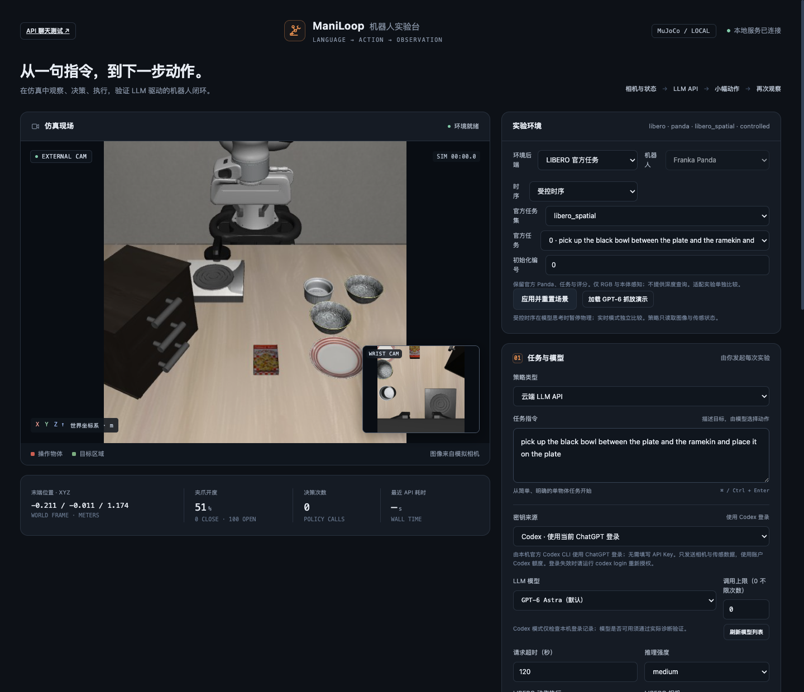
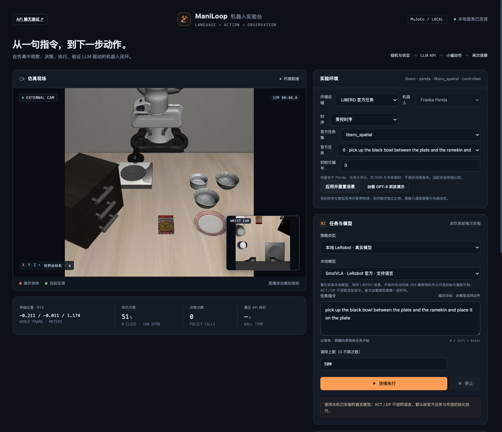

# ManiLoop

[English](README.md) · **[简体中文](README.zh-CN.md)**

**在本地运行机器人操作实验，看清完整的视觉控制过程。** ManiLoop 通过浏览器工作台与命令行，将 GPT 或学习策略接入 MuJoCo 任务：选择任务、连接模型、执行动作，再核对实际发生了什么。

**[开始使用 ↓](#第一步--打开本地工作台)** · [连接模型](#第三步--连接模型) · [实测结果](docs/RESULTS.md#简体中文) · [项目网站](https://daniel-rmc.github.io/ManiLoop/?lang=zh)



*本机实际运行的工作台，展示当前中文界面。这是可操作的仿真程序，不是网站上的录制回放。*

## 可以运行哪些任务

工作台将**相机观测、模型动作、控制器反馈与独立评分**放在一起。你可以先手动调试，再连接模型；逐步执行 GPT 决策、暂停和继续、对照执行前后观测，通过命令行批量运行实验，并导出完整 LIBERO episode。

| 环境／任务 | 可执行的操作 |
| --- | --- |
| 内置 `pick_place` | 抬起红色方块，放入目标区域，松爪后等待稳定 |
| 内置 `push` | 沿桌面将方块推入目标区域，不抬起方块 |
| `libero_spatial` · 10 个任务 | 根据物体间的空间关系选择并移动碗 |
| `libero_object` · 10 个任务 | 抓取不同物体并放入篮子 |
| `libero_goal` · 10 个任务 | 开抽屉、放置物体、推盘子、操作炉具等目标变化 |
| `libero_90` · 90 个任务 | 厨房、客厅与书房操作，包括抽屉、微波炉和堆叠 |
| `libero_10` · 10 个任务 | 涉及多个物体或多项操作的较长任务 |

内置任务支持 **ARX X5 和 Franka Panda**，均可选择 `tabletop_a`、`tabletop_b` 两种布局。LIBERO 使用官方 Panda、初始状态、OSC 控制器与成功规则。表中列出的是可用任务目录，不代表每个模型都已完成全部任务。修改文字指令不会改变任务的评分规则。

策略只接收图像和机器人传感状态。**物体真值、仿真接触、奖励和任务成功信号不进入策略输入。** 独立评估可以读取仿真状态并终止 episode；模型自己声明 `done` 不等于任务成功。

[查看真实手动调试界面：点动与夹爪控制、本体观测、执行反馈和独立评分](docs/images/workspace-feedback.png)。该图记录手动点动后的反馈，不是任务成功截图。

## 第一步 · 打开本地工作台

准备 **Python 3.12**、Git 和可用的 OpenGL 环境。使用云端 GPT 不需要本地模型权重或 GPU；基础程序不依赖 ROS、Docker 或实体机械臂。

**macOS / Linux**

```bash
git clone https://github.com/Daniel-rmc/ManiLoop.git
cd ManiLoop
python3.12 -m venv .venv
source .venv/bin/activate
python -m pip install -r requirements.txt
python -m maniloop demo
```

**Windows PowerShell**

```powershell
git clone https://github.com/Daniel-rmc/ManiLoop.git
cd ManiLoop
py -3.12 -m venv .venv
.\.venv\Scripts\python.exe -m pip install -r requirements.txt
.\.venv\Scripts\python.exe -m maniloop demo
```

打开 [http://127.0.0.1:8765](http://127.0.0.1:8765)。选择机器人、布局和任务，应用配置，试用手动移动与夹爪控件，再重置场景。**这一步不需要 API Key。** 服务只监听本机地址；使用时保持终端运行，按 `Ctrl+C` 关闭。如需换端口，启动时加 `--port 8766`。

继续以下步骤前，先停止服务，并保持在仓库根目录操作。**Windows 用户**将后续 `python` 命令替换为 `.\.venv\Scripts\python.exe`；多行 Bash 示例合并为一行，并去掉行尾的 `\`。安装 `uv` 后，运行任一安装脚本时加 `--uv .\.venv\Scripts\uv.exe`。无需执行激活脚本或修改执行策略。

无显示器的 Ubuntu/Debian 可安装 `libosmesa6`，在启动 Python 前设置 `MUJOCO_GL=osmesa`；已有兼容 GPU 驱动时也可使用 EGL。这些 Linux 设置不适用于 macOS。

<a id="在-libero-中运行-gpt"></a>

## 第二步 · 添加官方 LIBERO 任务

```bash
python -m pip install uv
python scripts/setup_libero.py
python -m maniloop list --backend libero --libero-suite libero_goal
python -m maniloop smoke --backend libero
python -m maniloop demo --backend libero --port 8767
```

打开 [http://127.0.0.1:8767](http://127.0.0.1:8767)。在环境面板选择任务套件、任务 ID 与初始化 ID。ID 从零开始，`list` 会列出任务名称。默认是 `libero_spatial` 任务 0、初始化 0：将盘子与小碗之间的黑碗放到盘子上。

安装器需要网络与数 GB 磁盘空间，无需示范数据集或策略权重。它下载固定版本的官方源码、资源与由项目管理的 Python，并将依赖分开：

| 环境 | 职责 |
| --- | --- |
| `.venv` · Python 3.12 | 主程序、网页、模型连接与内置 MuJoCo 场景 |
| `.venv-libero` · Python 3.10 | LIBERO 仿真及固定依赖 |
| `.venv-vla` · Python 3.12 | 可选的 LeRobot 与学习策略推理 |

三个环境保持隔离。详见 [LIBERO 安装与任务选择](docs/LIBERO.md)。

## 第三步 · 连接模型

选择以下一种方式；更换启动命令前，先停止已有的本地服务。

| 模型接入方式 | 如何连接 | 兼容边界 |
| --- | --- | --- |
| 通过 Codex 使用 GPT | 在官方 Codex CLI 登录，选择 Codex 来源 | 使用该 CLI／账户可用的模型；ManiLoop 不提取登录 token |
| 云端或自托管视觉模型 | 填写服务基础地址、模型 ID、API Key，或导入供应商 TOML | 机器人控制需要 **Responses API、图像输入和 JSON Schema 输出** |
| 本地 LeRobot 检查点 | 选择由独立推理进程加载的支持模型 | 当前提供三个已核对的 LIBERO 检查点预设，不是任意模型文件夹导入 |

<details><summary>查看实际本地程序中的模型配置</summary>



*当前本地界面；这里的模型和任务设置用于真实执行。*
</details>

### GPT 与兼容模型 API

安装近期官方 [Codex CLI](https://github.com/openai/codex)，然后运行：

```bash
codex login
python -m maniloop demo --backend libero --codex-login --port 8767
```

选择 Codex 来源并加载 GPT 演示预设，从文字、图像、动作格式诊断或单个动作开始。安装了多个 CLI 版本时，可用 `MANILOOP_CODEX_BIN` 选择所需程序。详见 [GPT 操作说明](docs/GPT6_DEMO.md)。

通过 API 连接时，选择手动填写或导入配置来源，填写模型 ID、供应商基础地址与密钥。可参考 [OpenAI 配置](examples/openai.example.toml)和[自定义供应商配置](examples/custom.example.toml)。自己部署的本地模型也可走这条路径，**前提是服务端实现所需的 Responses 协议**，例如使用本地地址 `http://127.0.0.1:8000/v1`。仅支持 Chat Completions 的服务不能用于机器人控制；独立的[文字聊天页](docs/API_CHAT.md)支持这两种协议。填写模型 ID 不代表模型一定支持视觉与结构化动作。模型请求使用所选账户额度或供应商计费；打开网页不会自动推理。

### 本地 SmolVLA、ACT 与 Diffusion Policy

```bash
python scripts/setup_vla.py --models smolvla-libero act-libero diffusion-libero
python -m maniloop demo --backend libero --port 8767
```

在页面选择本地 LeRobot 来源与已下载模型。省略 `--models` 则只安装 SmolVLA。推理可离线运行于 CPU、Apple MPS 或 CUDA，保留检查点保存的预处理与动作队列。

也可直接通过命令行调用本地检查点；将 `smolvla-libero` 替换为 `act-libero` 或 `diffusion-libero` 即可选择其他已安装的预设：

```bash
python -m maniloop benchmark --backend libero --agent lerobot \
  --local-model smolvla-libero --libero-suite libero_spatial --libero-task-id 0 \
  --init-state-id 0 --seed 0 --max-calls 500 --max-sim-seconds 25 \
  --max-wall-seconds 1800 --output runs/local-demo
```

| 预设 | 检查点 | 输入 |
| --- | --- | --- |
| `smolvla-libero` | [lerobot/smolvla_libero](https://huggingface.co/lerobot/smolvla_libero) · 官方 | 图像、机器人状态与语言 |
| `act-libero` | [Deepkar/libero-test-act](https://huggingface.co/Deepkar/libero-test-act) · 社区 | 图像与机器人状态 |
| `diffusion-libero` | [ttotmoon/diffusion-libero-v3](https://huggingface.co/ttotmoon/diffusion-libero-v3) · 社区 | 图像与机器人状态 |

如果这些预设**已经存放在另一块本地磁盘**，将 `MANILOOP_MODELS_ROOT` 设为它们的父目录。目录内须包含与预设同名的文件夹，如 `smolvla-libero/`，SmolVLA 还需要 `smolvlm-tokenizer/`。`MANILOOP_VLA_PYTHON` 可指向兼容的推理环境。这些设置用于更换受支持快照的存放位置，不会导入任意 Hugging Face 仓库或自定义权重。目录要求与固定版本见[本地模型指南](docs/VLA.md)。

### 接入自己的检查点或策略

新的检查点需要单独注册模型，配置正确的预处理、动作映射与来源信息。不要直接替换预设文件后仍将它标作原预设。若要使用自己的推理实现，可实现 [`Agent`](src/maniloop/agents/base.py) 的 `reset()` 与 `decide(task, observation, images, history, geometry_results)`，返回动作字典或 [`ActionChunk`](src/maniloop/core/actions.py)，再接入 `EpisodeRunner`，按需增加 CLI／UI 选项；当前没有自动加载任意检查点的通用入口。

增加仿真后端时，实现 [`Environment`](src/maniloop/backends/base.py)，并在[环境工厂](src/maniloop/backends/factory.py)中注册。需要匹配相机与状态输入、动作维度、单位和时序，并保持独立评分隔离。详见[架构与扩展接口](docs/ARCHITECTURE.md)。

## 第四步 · 录制完整尝试，检查结果

以下命令从官方初始化运行一次新的 GPT-6 尝试，并录制每个 LIBERO 控制步：

```bash
python -m maniloop benchmark \
  --backend libero --libero-suite libero_spatial --libero-task-id 0 \
  --init-state-id 0 --seed 0 --agent llm_cloud --codex-login \
  --model gpt-6-astra --context-mode paired --reasoning-effort medium \
  --max-calls 0 --max-wall-seconds 3600 --record-episode \
  --output runs/gpt-demo
```

默认 `controlled` 时序在模型推理期间暂停物理。`--max-calls 0` 取消决策次数上限，官方终止、仿真时长与墙钟预算仍生效。每次尝试生成独立目录，包含 `manifest.json`、`events.jsonl`、`result.json` 和 `replay.html`。检查 **`result.json → evaluation.success`** 获取独立结果；本地打开 `replay.html`，按决策回看过程。完整画面与校验信息存于 `recording/`。

安装 `ffmpeg` 后导出视频：

```bash
python -m maniloop.recording.video runs/gpt-demo/EPISODE_ID/recording
```

将 `EPISODE_ID` 替换为实际运行目录名。导出器先核对帧序列与摘要，再生成 `episode.mp4`；需要时用 `--ffmpeg /path/to/ffmpeg` 指定编码器。失败尝试同样保存，可加 `--allow-failure` 导出。视频按仿真时间播放，省略物理冻结的模型等待。详见[录制与导出说明](docs/EPISODE_RECORDING.md)。使用[示例矩阵](examples/libero-local-suite.toml)批量运行三个本地模型：`python -m maniloop benchmark --suite examples/libero-local-suite.toml --output runs/local-suite`。

## 录制示例与实测结果

无需安装，也可[探索录制工作台](https://daniel-rmc.github.io/ManiLoop/playground/?lang=zh)或[观看成功 episode](https://daniel-rmc.github.io/ManiLoop/?lang=zh#demo)。公开回放使用已保存的数据；**新的任务执行和模型请求需要在本地程序中运行**。试试「单步查看」，对照「执行前」与「执行后」，再跳到第 46 次决策的最终画面。

这条 GPT episode 包含 46 次决策、706 个控制步，其中包括抓取重试。完整视频含 707 组双相机画面，20 fps，时长 35.35 秒。官方成功在最后一次下降时触发，环境立即停止，没有额外验证松爪与退离。

| 模型 | 官方结果 | GPT 请求／本地推理次数 | 控制步数 | 仿真时间 |
| --- | --- | ---: | ---: | ---: |
| GPT-6 Astra | 成功 | 46 | 706 | 35.30 秒 |
| SmolVLA | 成功 | 2 | 78 | 3.90 秒 |
| ACT | 预算内未成功 | 5 | 500 | 25.00 秒 |
| Diffusion Policy | 成功 | 10 | 79 | 3.95 秒 |

每行是在 `libero_spatial` 任务 0／初始化 0／seed 0 上**选取的一次运行，不是成功率或模型排名**。GPT 产生高层动作，本地推理生成供多个控制步使用的动作队列。输入、控制器、预算和运行入口不同，墙钟耗时也不能直接比较。重新运行模型可能得到不同结果。详见[完整结果与运行条件](docs/RESULTS.md#简体中文)。

## 使用指南、检查与适用范围

[LIBERO 任务](docs/LIBERO.md) · [GPT 操作](docs/GPT6_DEMO.md) · [本地检查点](docs/VLA.md) · [API 文字聊天](docs/API_CHAT.md) · [录制](docs/EPISODE_RECORDING.md) · [架构](docs/ARCHITECTURE.md)

```bash
python -m pip install -r requirements-dev.txt
python -m pytest -q
python -m maniloop smoke
```

这些检查不发送模型请求。离线测试覆盖 macOS、Linux 和 Windows；渲染已在 macOS 与 Linux OSMesa 上验证，Windows 渲染和 LIBERO 运行尚未验证。渲染需要图形后端。ManiLoop 用于仿真：ARX 夹爪采用近似模型，软件未作为真机控制或安全系统验收。使用官方 LIBERO 资源，不等于具有论文级基准可比性。

<a id="许可证与贡献"></a>

## 许可证

ManiLoop 采用 [MIT 许可证](LICENSE)。ARX X5 资产保留 MIT，Panda 资产保留 Apache-2.0。LIBERO、LeRobot 和下载的检查点分别保留自己的许可证。详见[第三方声明](THIRD_PARTY_NOTICES.md)。
