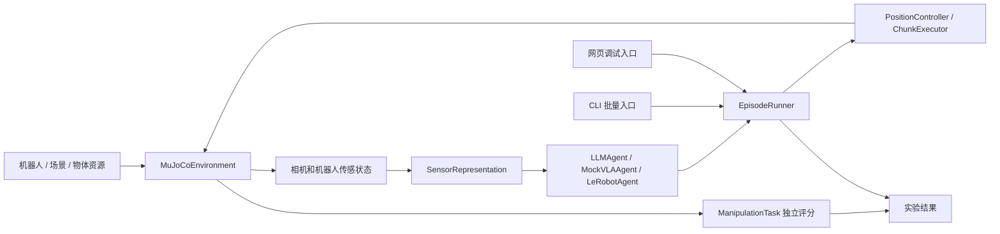

# ManiLoop 框架

ManiLoop 将模型、传感输入、动作接口与本地控制器连接成完整策略配置。命令行实验与网页使用同一个运行器，记录相同的配置、控制过程和独立结果。

## 实现概览

| 组件 | 功能 |
| --- | --- |
| 具身体 | ARX X5、Franka Panda，单臂与平行夹爪 |
| 场景和任务 | 两个桌面布局；抓放与推物分别评分 |
| 策略 | 云端 Responses 兼容 LLM；模拟动作块；独立 LeRobot 本地学习策略 |
| 数据边界 | 仅传感器输入；没有真值策略入口 |
| 评测模式 | 固定策略，每个 episode 重建策略并清空历史 |
| 时序 | 受控时序默认；实时模式独立比较 |
| 入口 | 命令行矩阵实验与本机网页共用 EpisodeRunner |

## 数据流与职责

- `robots/specs.py` 的 `RobotSpec` 描述关节顺序、执行器、夹爪传感范围、工作空间和模型来源。Panda 的夹爪控制为 0–255，编码器为 0–0.04 米；两者显式分开。
- `assets/robots` 保留机器人模型与许可证；`assets/scenes` 提供公共桌面、光照、相机；`assets/objects` 提供物体。`simulation/scenes.py` 负责组装，布局数据与资源文件分开。
- `MuJoCoEnvironment` 管理模型、物理状态、重置和传感器。`PositionController` 负责 IK、关节限位与已知固定障碍 / 自碰撞检查。控制器不求解物体任务。
- `ManipulationTask` 提供文字指令、任务生命周期和独立评分。评分每个物理步更新，网页刷新频率不会改变成功判定。
- `Agent` 协议接收文字、传感观测、图像、历史和深度查询结果。`LLMAgent` 组合 API / Codex provider，`LeRobotAgent` 连接独立本地推理进程。
- `EpisodeRunner` 拥有单次闭环、停止 / 重置令牌、推理请求、动作块和时序。命令行和网页均调用它的 `advance()`；不各自实现一套物理推进规则。
- `evaluation/benchmark.py` 负责矩阵展开、固定策略隔离与结果；`recording/manifest.py` 记录公开实验配置与来源。

`arx5_demo` 导入与启动入口作为兼容层保留。核心 Python 包安装到 `src/maniloop`；资源跟随包一起安装，运行结果写到用户指定目录。

## 策略能读什么

策略输入包括双相机 RGB、外部相机的按像素深度查询、相机标定、关节名称 / 位置 / 速度、基于机器人运动学的 TCP 位姿、夹爪开度、动作限制、观测 ID 与执行反馈。

`SensorRepresentation` 在共用输入边界校验字段并复制数据。API provider 再次校验允许的观测字段。物体真值位姿、目标真值中心、接触列表、评分结果、模拟器对象及 MuJoCo 模型句柄不传给策略。策略对象不能持有环境或评分器引用。

仿真真值只用于初始化、独立评分与离线物理测试。记录文件可以包含供研究者审计的场景配置与评分，**这些记录不回流至模型输入**。相机外参和 TCP 来自标定 / 机器人运动学。

这是明确的数据接口约束，不是针对任意不可信 Python 插件的安全沙箱。已支持的 LIBERO 与 LeRobot worker 分别提供仿真依赖与模型推理的进程隔离。

## 动作与时序

`Action` 统一表达 TCP 增量、带关节名称的绝对关节目标、夹爪或等待；采用米、弧度、秒，坐标系明确为机器人基座或后端声明的世界坐标系。LLM 的单步 JSON 在边界转为 `Action`；深度查询和结束声明是控制消息。

`ActionChunk` 包含观测 ID、一组 `Action` 和采样间隔，限制为 1–64 个采样，间隔 0.02–1 秒。模拟 VLA 输出两个小幅关节目标；`ChunkExecutor` 按仿真时钟逐个校验和执行，然后等待停稳并重新观察。没有静默单位转换、动作裁剪或任意代码执行。

自建 MuJoCo 后端的单步 TCP 动作通过 IK 和轨迹插值执行；动作块通过周期性位置设定值执行。两者均有命名关节、限位、工作空间和碰撞检查。动作块还检查每个采样对应的 TCP / 关节速度。它们的执行能力和节奏不同，结果中使用不同的动作接口 ID，不能只按模型名称比较。

受控时序中，模型推理和同一快照的深度问答暂停物理推进；墙钟时间预算仍有效。实时模式按墙钟推进，检查观测年龄、机器人漂移和图像变化；追赶量受限，不能视为硬实时。推理过程中停止或重置，会废弃在途响应；动作块剩余采样也会取消。

批量实验分别记录决策、仿真时间和墙钟预算；`--max-calls 0` 取消决策次数限制。自建桌面任务在模型声明结束后允许最多 1.2 秒固定静置窗口完成稳定性判定，并受剩余仿真预算限制。模型声明结束不等于独立评分成功。

## 评分与可复现性

抓放：红块先抬至中心高度超过 6.5 cm，随后完整进入绿色区域、落在桌面、夹爪释放并离开，稳定 1 秒。

推物：红块沿桌面进入目标区域，过程中物体底部不得高于桌面 1.5 cm，末端离开后稳定 1 秒。这些容差属于任务版本，修改时必须更新 evaluator ID。

每个 episode 保存实际指令、策略类型 / 模型 / endpoint、请求选项、表示和动作接口版本、控制器参数、时序和预算、随机种子、机器人来源版本、代码摘要、依赖版本及独立结果。比较组依据策略配置计算；机器人、布局、任务和种子是独立实验轴。随机种子固定重置扰动，不保证不同硬件的物理结果逐位一致，也不消除云端模型随机性。

模拟策略的记录标记 `is_mock=true`。物理测试中的已知坐标只用于证明场景可操作，不能作为模型自主成功率。真实模型的已记录结果与比较范围见 [RESULTS.md](RESULTS.md)。

## 外部基准后端：LIBERO

`backends/base.py` 的 `Environment` 协议定义时钟、观测、动作、生命周期、描述与评分。`backends/factory.py` 选择自建 MuJoCo 或 LIBERO；运行器只调用这些操作，不再读取 `model.opt` / `data.time`。`create_chunk_executor()` 让每种环境保留自己的控制语义，而不是为 LIBERO 套用自建 IK。

`backends/libero/environment.py` 在主进程实现环境协议；`transport.py` 负责有请求编号、大小限制、超时和退出清理的本地 JSON 通信。`worker.py` 在独立 Python 3.10 中导入固定版本的 LIBERO / robosuite，只有它接触旧引擎。worker 不继承主进程的 API 凭据和 Python 路径。它是依赖隔离机制，不是运行不可信代码的安全沙箱。

worker 显式构造传感字段，从不透传上游完整 observation（其中包含物体真值）。评分使用单独操作返回给运行器和记录系统。RGB 图像、机器人运动学和相机标定经既有表示边界送给策略。

原生 VLA `osc_pose` 明确使用 7 维归一化输入、world 坐标系、20 Hz；LLM 米 / 弧度动作经过单独命名的 OSC 转换。控制步只由 `Environment.step()` 推进，动作块 tick 只提交命令，避免一份动作执行两次。LIBERO 不执行额外稳定窗口；官方成功或预算终止后停止。

资源保留在可选上游安装中，不把大体积官方 assets 混进自建 `assets/`。源码版本、初始化文件摘要、控制参数、运行依赖与图像处理进入 manifest；不同协议明确分组。安装与比较限制见 [LIBERO.md](LIBERO.md)。

## 本地 LeRobot 推理

`agents/lerobot/agent.py` 实现统一 Agent 接口，通过独立 `.venv-vla` 进程加载固定公开权重。推理 worker 只收到两路图像、任务语言、TCP 位姿与夹指编码器，既不持有仿真对象，也不收到评分或物体状态。`catalog.py` 集中维护可复现的模型来源，安装器复用该目录。

LIBERO 的 `lerobot_rgb256` 观测配置保留无损图像及原始机器人四元数和夹指关节值。worker 使用 LeRobot 官方环境处理器和检查点自带 pre/postprocessor；不同图像与控制协议独立分组。每个控制步返回一个 OSC 动作，LeRobot 保留自己的动作队列；DP 因此每步收到新观测，并保持两个连续控制步的历史输入。模型推理次数与控制决策数分开记录，超出归一化控制边界的输出显式裁剪并计数。

ACT / Diffusion 是非语言条件的视觉模仿基线，SmolVLA 是语言条件策略。模型家族、来源、设备、原始采样配置与权重摘要进入实验记录。详见 [VLA.md](VLA.md)。

## 云端 LLM 目标闭环

GPT / API 策略支持文字、图像、结构化动作诊断、`llm_rgb512` 观测和 `controllers/target.py` 的固定目标伺服。`EpisodeRunner` 记录执行终态反馈，并支持 current / paired 上下文、单步、暂停与连续运行。决策回看保存前后帧；可选完整录制保存初帧和每个原生控制步，校验后导出双相机 MP4。使用方法见 [GPT6_DEMO.md](GPT6_DEMO.md) 和 [EPISODE_RECORDING.md](EPISODE_RECORDING.md)。

## 外部操作任务：robosuite

`backends/robosuite` 是独立 Python 3.11 worker，使用固定 robosuite 1.5.2 / MuJoCo 3.3.7。
主进程仍只依赖 Environment 协议，CLI 和网页共用 EpisodeRunner；LIBERO 不迁移。
首版使用 Panda、显式 world-frame OSC 与一致的末端 site 姿态；只有 step 推进物理。
RGB 在观察时从当前状态显式渲染，评分走独立操作，不向模型返回物体真值或评分。
任务目录独立于仿真安装，可供 CLI 与网页读取；实际初始化和运行依赖由 worker 检查。
完整使用说明与支持边界见 [ROBOSUITE.md](ROBOSUITE.md)。
