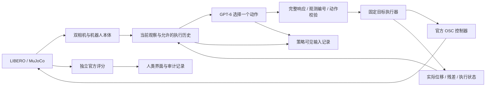

# GPT-6 仿真操作 Demo 改造计划

> 实施更新（2026-09-16）：本计划保留最初设计与验收建议；当前已实现入口及真实验证状态见 [GPT-6 演示使用说明](../GPT6_DEMO.md) 和 [M13 worknote](../worknotes/worknote.md)。下文“拟实施”等表述描述方案编写时状态。

日期：2026-09-16。状态：**方案已整理，尚未实施或进行付费验证**。

依据：当前工作区、交接与最新 M11 工作记录，以及七个外部项目的在线研读。当前本地 HEAD 为 `1d5ea307daeb00155feabee00015d478b5b01eae`，分支为 `fix/new-machine-recovery`，含既有未提交修改；本文以实际工作区为准，不覆盖既有工作。本文提供建议，未代替用户选定参考仓库、调用预算或论文方案。

## 1. 要交付的演示

用户在现有网页选择官方任务并填写模型配置后，GPT-6 反复读取相机图像与机器人本体状态，决定一个短程动作，由本地控制器执行，再根据新观察决定下一步。页面能看清模型观察、动作、执行反馈和独立结果，完整过程能够回看。

第一项任务建议固定为 **LIBERO spatial task 0：把盘子与小碗之间的黑碗放到盘子上**，先用 init 0 / seed 0。这是本机已经验证过环境、控制器和本地模型链路的任务，但 GPT-6 在这里仍没有已证实的成功记录。

演示希望呈现：识别目标 → 接近与对齐 → 闭合夹爪 → 抬起并观察 → 搬运 → 放下与释放。此顺序是给观众理解任务的说明；程序不按物体坐标硬编码执行它，也不把阶段名称当成已完成证据。官方提前终止时立即停止，额外展示要求不改变官方评分。

第一版以 GPT 直接选择动作为主。随后可增加推物、开抽屉，或 GPT 与本地 VLA 协作；它们分别验收，不是完成第一个 demo 的前置条件。

## 2. 当前已有的基础与真实缺口

| 模块 | 当前工作区实际情况 | 本计划处理 |
|---|---|---|
| 系统与环境 | 主环境、独立 LIBERO、独立 LeRobot 已恢复，用户已人工验收 | 复用现有三环境，不增加新仿真框架或下载大型权重 |
| 云端请求 | `GPTPolicy` 默认模型为 `gpt-6-astra`，已用 Responses 发送图像和严格 JSON 动作 | 先验证实际供应商的图像、完整响应与动作协议；不把文字聊天通过算作通过 |
| 模型动作 | `move / gripper / wait / done / query_depth`；LIBERO 不支持深度查询 | 首轮保留现有协议；它是结构化 JSON 动作，不是已经实现的 Responses 原生 function calling |
| LIBERO 观测 | 外部与腕部 RGB512、TCP、关节、夹爪、标定和反馈 | 保留当前传感协议；先不加物体检测、分割或深度 |
| 动作执行 | `tcp_target_servo_v2` 固定一次目标，以本体反馈追踪；20 Hz、最多 20 步 | 复用现有执行器及官方 OSC；对照请求动作和终态反馈 |
| 历史 | runner 保留近期动作／反馈，provider 附当前图像；没有历史图像配对 | 基线运行后，再增加一个已完成动作的前后图像及本体状态 |
| 网页 | 配置、三层诊断、双相机、手动点动、开始／停止、动作日志和独立评分 | 增加演示预设、单步决策、清晰状态、前后对照与回看入口 |
| 记录 | 已有 manifest、事件、请求时相机图像与观测 | 补齐实际发送上下文摘要、成对反馈、运行摘要与可分享回放 |
| 隔离 | 观测顶层允许列表、worker 构造传感字段、独立评分操作 | 对新增嵌套反馈和历史建立字段约束；验证整个请求，而非仅顶层字段 |

代码依据：[`responses.py`](../../src/maniloop/providers/responses.py)、[`runner.py`](../../src/maniloop/runtime/runner.py)、[`target.py`](../../src/maniloop/controllers/target.py)、[`LIBERO.md`](../LIBERO.md)、[`ARCHITECTURE.md`](../ARCHITECTURE.md)。

当前阻塞是实际供应商的图像／动作协议和 GPT 操作能力尚未验证。真实云端失败可能来自通信、视觉定位、动作选择或执行，必须先保留证据再针对性修改。

## 3. 第一版控制与数据流



- GPT 决定接近哪里、怎样转动、何时闭合／张开、是否重试或声明完成。它只看到传感证据与允许的历史。
- 本地执行器只跟踪目标并返回本体反馈；不识别物体、不自动计算抓取中心、不替 GPT 完成抓放流程。
- 延续 controlled 时序：模型等待期间暂停物理，实际动作执行期间推进物理，墙钟预算持续计量。页面明确显示这是分步视觉闭环。
- `reached` 只表示 TCP 在当前容差内到位；夹爪 `completed` 只表示稳定。抓住、放好等语义判断仍需图像证据。
- `done` 是模型声明；官方评分由 runner 读取并显示，评分触发停止后不再将结果发送给策略。
- `/api/state` 含 `evaluation` 和环境描述，仅供人类调试。模型始终经传感表示入口获取数据，不能读取整页截图、调试 API 或审计目录。

## 4. 动作接口：先沿用，再按证据扩展

首轮继续使用现有有界 TCP 增量。平移为米，旋转为同一 world 坐标系的轴角向量；旋转不是 Euler 角。增量仅在接收时转换一次为固定目标，后续控制步追踪同一目标。

| 动作 | 首轮约定 |
|---|---|
| `move` | 一个有界平移／旋转动作；保持原夹爪命令 |
| `gripper` | 单独控制夹爪，0 闭合、1 张开；保持 TCP 目标 |
| `wait` | 受预算约束地重新观察；保持现有后端语义 |
| `done` | 模型认为完成；独立结果另行记录 |

每次动作携带当前 `observation_id`。不完整、非法数值、越界或过期响应不执行；不以默认下降、沿用旧动作等方式兜底。网络超时后不自动重放动作。

如果首轮证据显示主要困难在坐标表达，可单独加入 `move_to` 绝对目标或方向词动作，再映射到现有 `PoseTarget`，明确版本并与当前接口分组。九动作、MCP、Codex 完整 agent 和高层 `grasp(object)` 均不作为首版依赖；尤其不能在高层工具内部读取物体真值来制造成功。

## 5. 按顺序实施及验收

下列 D0–D4 是拟实施阶段，当前只完成了计划编写。

| 阶段 | 工作 | 通过条件与产物 |
|---|---|---|
| D0：固定运行条件，约半天 | 保存无凭据的 demo 预设；核对既有修改；离线验证请求载荷、坐标／旋转／夹爪和终止流程 | 记录任务、init、seed、图像、动作接口、模型设置与预算；模拟供应商检查不访问外网 |
| D1：用原链路跑通，约半天至一天 | 用户提供配置并确定调用上限后，依次做文字、单图、双图动作诊断；一次小位移；一次完整任务尝试 | 三种诊断只展示不执行；小位移核对实际反馈；完整尝试无论成功失败都保存。仅官方成功才能标记 GPT 任务成功 |
| D2：按失败证据补控制上下文，约一天 | 优先补前后观察配对、执行反馈去重与版本化；必要时才改提示词或动作表达 | 同一动作从接受到结束有一条完整记录；前后帧／状态／动作属于同一 episode 且顺序正确；旧协议仍可选 |
| D3：整理演示体验，约一天 | 单步／连续执行、动作状态卡、前后图像对照、运行摘要和回看；断线／停止状态清楚 | 一次单步最多一个模型决策；动作结束后停在决策边界；停止／重置后旧响应不能执行；回放不调用模型或触发控制 |
| D4：冻结版本复验，约半天至一天 | 在同一最终配置上，按事先列出的 init 0、1、2 各运行一次；记录全部尝试 | 完整说明逐次结果。3/3 是演示就绪目标，不是承诺或 LIBERO 总成功率；未达到时明确标为有限成功／尚未就绪 |

预计 **3–5 个工作日**完成第一版工程与小规模验收；这是任务估计，取决于 API 可用性、模型失败类型与反馈迭代。D1 若已成功，先保留可用基线；D2 的改进不能抹去或覆盖原有结果。若 D1 未成功，先分类阻塞，不保证靠页面改造获得成功。

每完成一阶段，在 worknote 记录实际变更、验证、运行编号和剩余限制。现阶段不运行这些步骤、不开始训练或论文实验。

## 6. 需要改动的文件与边界

| 位置 | 计划改动 | 说明 |
|---|---|---|
| `examples/gpt6-libero-demo.toml`（拟新增） | 无凭据的固定任务／预算预设 | 对接现有配置解析；确切字段在实现时遵循现有 CLI／套件格式，本文不假装该文件已存在 |
| `core/observations.py`、`representations/sensors.py` | 对新增历史与执行结果定义嵌套允许字段 | 当前顶层检查不等于新增嵌套内容已安全；评分字段即使藏在 `last_feedback` 或历史中也不得进入请求 |
| `providers/responses.py`、`agents/llm.py` | 当前双图加上一动作的前后证据；保留原输入模式 | 增加必要参数时显式传递，不使 policy 持有环境／评分器；不启用远端跨 episode 记忆 |
| `runtime/runner.py` | 配对观察、动作和终态；实现单步／暂停边界；预算与停止状态 | 继续作为 CLI 和网页唯一运行器；接受反馈与终态反馈合成同一动作记录，避免重复条目挤占历史 |
| `ui/index.html`、`ui/server.py` | 演示预设、单步控制、反馈卡、只读回看入口 | 在现有页面扩展；配置信息不进入回放，模型文字以纯文本显示 |
| `recording/manifest.py` 与必要的记录模块 | 上下文版本、实际发送帧摘要、人工干预标记、摘要／回放 | 视频或回看读取已记录内容，不再次请求模型；输出写入忽略目录 |
| `tests/test_policy.py`、`tests/test_loop.py`、`tests/test_libero_integration.py` | 请求隔离、动作时序、回归与本体控制 | 以真实边界和状态转换为检查对象；界面布局不添加镜像式测试 |

上述代码路径均以 `src/maniloop/` 为前缀（`examples/` 和 `tests/` 除外）。官方 LIBERO 源码、任务初始化、控制器参数、动作缩放和成功规则保持原协议。现有 LeRobot 模型继续使用其原生 RGB256／OSC 接口。

## 7. 执行历史与视觉上下文

建议新增一个版本化的 `completed_action` 记录，包含：前后 observation ID、仿真时间、TCP 位姿、夹爪状态、请求动作、实际位移、位置／旋转残差、执行状态与控制步数。终态是 `reached / completed / timed_out / rejected / interrupted` 等执行器事实，不含“抓取成功”或“任务已完成”的真值结论。

模型输入从最近一次完整动作开始配对：前一轮双相机与当前双相机，最多四张 RGB 图，明确前／后时间标签；首轮只有当前双图。更早历史只保留有界文字记录。图像仍采用现有方向与分辨率，不把网页评分、隐藏目标位置或带真值标注的图片送入模型。

前后双图会增加图像输入与延迟，因此保留当前双图模式作为基线，记录图像数量、摘要、上下文版本和用量。先验证增量收益，再考虑长历史、自动摘要或跨 episode 经验。

阶段判断仅为模型的可见证据陈述：例如“物体似乎随夹爪抬起”，不能因夹爪闭合就自动填“已抓住”。若未来增加结构化 `current_subgoal / evidence / expected_effect`，应作为独立 schema 版本；首轮利用现有 `explanation` 展示简短依据即可。

## 8. 网页与回放交付

沿用 `http://127.0.0.1:8767/` 的 LIBERO 页面和 `http://127.0.0.1:8769/chat` 的独立聊天入口。这是现有地址约定；本轮没有重启服务或重新检查其存活状态。端口变化时以实际启动结果为准。

演示页面建议采用以下布局：

- 主视区保留外部相机，旁侧固定腕部图；可切换当前／动作前后对照。
- 一张动作卡按顺序呈现“模型可见依据 → 请求位移与夹爪 → 实际执行状态与残差”。模型依据只展示简短说明，不要求私有推理过程。
- 控制区提供单步决策、连续运行、在动作结束后暂停、停止及重置。暂停保留本 episode 上下文；停止取消后续决策，是否恢复必须有明确生命周期，不借用“开始”隐式重置。
- 独立评分单独显示，区分模型声明、执行器到位与官方任务成功。显示已用／剩余调用、墙钟、仿真时间、当前等待状态。
- 人工点动只在可控停止边界进行，并把该 episode 标成 assisted。自动验收不接受人工中途修正；单步按钮只调度时机、不改变动作，另记录调度模式。

每次运行至少保存：manifest、模型可见观察与动作时间线、执行终态、独立结果、终止原因和最终双相机画面。第一版回看优先复用已有逐次图像与事件；连续动作视频可在执行阶段采样生成，采样依据仿真时钟，不依赖浏览器刷新率。

分享版回放过滤凭据、私人配置、主机路径及无关供应商信息。视频注明仿真时间、真实等待时间及是否加速。保留全部原始尝试，不能用剪辑隐藏重置、人工接管或失败。回放不等于重新运行确定性策略，云端决策也不承诺逐位复现。

## 9. 验证与付费预算建议

### 离线与仿真检查

实施后的基本命令沿用：

```bash
python -m pytest tests/test_policy.py tests/test_loop.py tests/test_libero.py -q
MANILOOP_TEST_LIBERO=1 python -m pytest tests/test_libero_integration.py -q
```

若改变共用 runner，再运行完整离线回归。检查重点：

1. 对实际序列化请求检查所有嵌套字段、文字历史和图像来源；向反馈／历史注入测试用评分字段必须在网络前拒绝。测试数据使用虚构哨兵，不读取私人日志。
2. 三种诊断分别发送 0／1／2 图且不推进物理；小位移、旋转正负方向、夹爪符号与目标终态正确。
3. 单步不会变为多次调用；暂停／停止／重置／超时后没有重复物理动作，预算耗尽不启动新请求。
4. 已结束任务不再推进；模型 `done` 与评分失败可同时记录；未知 API 用量为 null，不写零。
5. 页面回看不读取任意本机文件、不发送模型请求；实际 CLI／网页走同一执行路径。

这些是**未来实施验收要求，本次未运行**。既有 M10/M11 测试成绩不用于证明新功能已通过。

### 有界云端验证

所有数字均是待用户选择的预算建议，不是已授权的自动调用额度。

| 批次 | 建议上限 | 停止条件 |
|---|---:|---|
| A：接口与首个任务 | 三层诊断 3 次 + 一次小位移 1 次 + 首轮任务最多 30 次，共最多 34 次请求 | 任一前置阶段失败，停止进入下一层；任务成功、模型结束、错误或预算到达即停止 |
| B：最终配置复验 | 冻结配置后，3 个初始化各最多 30 次，共最多 90 次 | 每个初始化只记一次预定尝试；追加调试单独记录，不能替换失败样本 |

初始建议：单次超时 120 秒、`reasoning_effort=low`、输出上限 4096 token；每 episode 最多 30 次请求、1800 秒墙钟，物理步数受官方剩余 horizon 和本地预算共同约束。墙钟预算可能先耗尽，并不保证执行满 30 次。

在正式请求前冻结实际生效设置。使用量与价格以用户选定供应商为准；不能从调用次数推断准确费用。先确定金额上限与分批额度，若供应商支持可配置服务端限额；超时可能已计费，不自动重试或切换模型。A 与 B 均不因本文产生自动运行授权。

## 10. 失败后的处理顺序

| 观测到的问题 | 下一步 |
|---|---|
| 文字通、图像或结构化输出不通 | 定位协议／模型权限／网关响应完整性，保存脱敏状态；先解决通信 |
| 动作合法但到位不足 | 对照请求、实际位移和残差；检查固定目标及坐标语义，不重复同一个增量掩盖问题 |
| 看错物体或缺乏空间证据 | 检查真实发送图像、方向、清晰度和前后历史；改动视觉提示时记录条件 |
| 抓空却继续搬运 | 增加抬起后的视觉核验上下文，观察模型是否会据证据重试；不由真值反馈替它判断 |
| 长期抓不到而调用耗尽 | 保留失败，将问题缩到对齐／接近／抓取阶段；可另跑自建红块场景诊断，清楚标记为新任务和输入条件 |
| 仅某一个初始化成功 | 交付为有限演示，展示全部尝试；暂不声称稳健操作或扩大实验规模 |

若加入相机坐标轴提示，只能由相机标定和机器人运动学计算；不得把物体真值点画到图中。自建场景的 RGB-D 和 LIBERO RGB 是不同观测条件，结果分开报告。

## 11. 后续技能与研究接口

第一版通过后，建议依次考虑：

1. **推物**：固定上游已有 `push_the_plate_to_the_front_of_the_stove`，展示接触后视觉修正。
2. **开抽屉**：固定上游已有 `open_the_middle_drawer_of_the_cabinet`，展示抓握、牵引和接触失败。具体编号从任务目录解析，不硬编码猜测；仅存在任务资产不等于本机物理和模型已通过。
3. **组合任务**：已有 `open_the_top_drawer_and_put_the_bowl_inside`，在单技能通过后再验收先后依赖。
4. **GPT＋VLA**：另建实验模式，明确何时接管／交还；使用同初态纯 VLA 对照。SmolVLA／DP 继续保留原预处理和动作节奏，不能把切换成功冒充 GPT 单独控制。

这些官方任务已在当前固定 LIBERO 的 `libero_goal` BDDL 目录中核对到名称，尚未在本轮逐一运行。任务评分仍使用官方规则。

Demo 记录可为“持续偏差与偶发失败”“判断是否落实到动作”留下接口，但第一版不引入扰动、训练或跨任务记忆。尤其 `PoseTarget` 本身会补偿执行误差，后续研究要区分控制器贡献和模型贡献。论文题目、预算与可证伪实验另行讨论。

## 12. 外部项目的参考范围

以下为 2026-09-16 在线取得的分支提交标识，链接固定到相应版本；没有在本机安装或复现。这里只借鉴机制，不选定导入某个仓库；实际复用代码前检查对应许可证，许可证未定的项目保持思路参考。

| 项目与固定版本 | 本计划参考点 |
|---|---|
| [Inspect Robots · 7e4d1b7](https://github.com/robocurve/inspect-robots/tree/7e4d1b7aee1c0d3cfc3a05a7492b9d12cda666f9) | [agent 文档](https://github.com/robocurve/inspect-robots/blob/7e4d1b7aee1c0d3cfc3a05a7492b9d12cda666f9/plugins/inspect-robots-agent/README.md)中的有界动作、到达反馈、记录与近期图像 |
| [StationeryBench · 43d5dd3](https://github.com/robocurve/stationerybench/tree/43d5dd380eeb9f555fe691a896a076cf43d3b18b) | 可观察阶段和最终成功分开；用于解释失败，不向策略提供阶段真值 |
| [GPT-Policy · ae45531](https://github.com/cheng-haha/GPT-Policy/tree/ae455319966b45acd8795949e0ea9f6f1c64aa6e) | 上下文组织、单动作执行反馈；示范视频不是第一版依赖 |
| [GPT-as-Policy · 8f3d362](https://github.com/anonymous-report-421/GPT-as-Policy/tree/8f3d362b077d8efb77e2a7274d5b2c20e2243846) | [执行／意图判断](https://github.com/anonymous-report-421/GPT-as-Policy/blob/8f3d362b077d8efb77e2a7274d5b2c20e2243846/hybrid_rollout/robodojo/robodojo_server/gate_assessment.py)作为后续协作参照；RoboDojo 是 Isaac Sim，且原反馈通路不直接复用 |
| [FluxVLA · 8b0d407](https://github.com/FluxVLA/FluxVLA/tree/8b0d407eb35b59a5969a13460b6b42d2763039eb) | [LIBERO 动作约定](https://github.com/FluxVLA/FluxVLA/blob/8b0d407eb35b59a5969a13460b6b42d2763039eb/docs/openai_libero_control.md)、旋转／夹爪诊断；ManiLoop 继续采用自己的固定目标反馈执行器 |
| [灵巧手 retarget · e71531f](https://github.com/lingxiao-guo/GPT6-dex-physical-retarget/tree/e71531f8223e7af147abcf3ca7fa68e5f13db75f) | 公开物理简化、验证与回放边界；不作为在线策略实现 |
| [Astra Paints · e0a0f59](https://github.com/riyer8/astra-paints/tree/e0a0f591d4f3e0c6998d49dff8cd195e4366183d) | 小闭环与可回看呈现；二维画布输入不能替代本项目三维相机观测 |

## 13. 本轮交付与下一步

本轮只新增本计划、文档索引和 worknote 记录。没有改生产代码、重建环境、下载模型、启动新服务、读取私人配置、运行模型或提交／推送。

建议下一步是按 D0 固定 demo 条件和验收清单，然后在用户配置及预算确定后做 D1。先取得一次真实图像→合法动作→物理反馈的完整证据，再决定 D2 具体改哪些部分。
