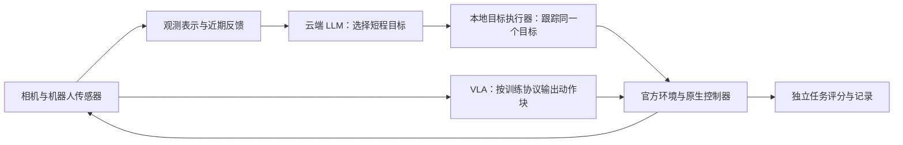

# 云端 LLM 运行诊断与下一版闭环设计

日期：2026-09-16。状态：**P1/P2 已实现并通过离线与真实控制器检查，云端任务评测待进行**。本文区分已有运行证据、控制器实验和建议；不宣称云端模型已完成任务。

## 当前交付状态

已提供：网页三种分层 API 诊断（仅响应，不执行动作）、120 秒可调请求超时、推理强度与实验预算、实际生效参数／失败耗时记录、结束场景重置保护、512 像素 LLM 双相机和固定目标控制器。原生单步与 LeRobot 通道仍保留。目标控制以 2 mm / 0.02 rad 及速度、连续稳定两步判定到位，最长 1 秒。

本地模拟供应商验证了真实 HTTP → SDK → 诊断流程，三个阶段分别发送 0 / 1 / 2 张图像，均只调用一次，机器人状态与仿真时间未改变；这不是 FC 服务复验。真实 LIBERO 控制器、旋转与图像检查通过，网页向上点动 10 mm 得到约 0.74 mm 三维残差。后续保留传感器辅助表示、流式诊断与云端任务评测，不将它们算作已完成。

以下第 1–2 节记录修复前的问题，第 3–4 节保留设计依据与后续路线。

## 1. 本次错误是什么

两次用户实验的本地记录分别为 `20260916-104048-1ac0dcd0` 和 `20260916-104211-abd4c0b8`，原始文件位于被 Git 忽略的 `runs/`。本文只保留诊断摘要。

| 记录 | 观测到的行为 | 可确定的结论 |
| --- | --- | --- |
| 10:40:48 启动 | 发出第一个请求后立即记录「环境已结束」；随后丢弃在途响应 | 已终止环境仍允许开始新 episode，浪费一次请求；应在任何推理调用前处理场景生命周期 |
| 10:42:11 启动 | 10:42:58 返回请求超时；决策动作数为 0、控制步为 0、仿真时间为 0 | 模型未返回可执行动作，失败发生在请求阶段，不能据此判断操作能力 |

源码为 SDK 设置 45 秒超时、关闭自动重试；本次经过 FC 的 Responses 兼容入口。约 47 秒墙钟与客户端配置一致，但日志不能定位是连接、网关排队、推理或读取阶段超时，也不能证明 Key 无效、额度不足、模型不支持图像或供应商宕机。需要分层请求诊断才能区分。

当前清单将环境变量原值记为请求参数；例如 `OPENAI_REASONING_EFFORT` 为空，但 `gpt-6-astra` 在 provider 内部实际默认 `low`。未来必须记录最终生效参数。失败事件没有保存精确耗时和错误分类，网页最近 API 耗时也只在请求成功后更新，这使排障证据不足。

## 2. 当前接口为什么会让 LLM 难以控制

### 每次云端决策只覆盖一个控制步

`libero_tcp_to_osc_v1` 将米／弧度增量转换为一次 20 Hz 的原生 OSC 指令。一次 `move` 只推进 0.05 秒，并不保证运动到位。自建 MuJoCo 后端的 TCP 动作则通过 IK／轨迹执行，两个后端的相似动作名容易造成不同预期。

独立实验：固定 spatial task 0 / init 0 / seed 0，要求末端沿世界 Z 轴上移 10 mm；只读取关节／末端本体状态，未使用物体位置、评分、模型或 API。

| 实验 | 原生控制步 | 仿真时间 | 实际 Z 位移 | 目标位置误差（3D） |
| --- | ---: | ---: | ---: | ---: |
| 现有接口执行一次 | 1 | 0.05 s | 1.1003 mm | 8.8998 mm |
| 执行一次，之后给 19 步零增量 | 20 | 1 s | 2.3495 mm | 7.6561 mm |
| 每步用本体反馈追踪同一个目标 | 20 | 1 s | 9.8278 mm | 0.1926 mm |

这里的 20 步反馈实验只是位置控制诊断，没有旋转、接触、抓取或任务成功验证。它表明单步设定值与到达目标之间的差异；不能外推成所有姿态下的精度保证。不要把同一个非零增量盲目重复 20 次，那会不断移动目标。

安装可选 LIBERO 依赖后复现：

```sh
python scripts/diagnose_libero_control.py
```

脚本在独立、无相机环境中运行；结果写入被忽略的 `artifacts/diagnostics/libero-control.json`。原生控制器、缩放和评分均保持现有设置。

### 观测分辨率与几何约束

本次真正发送的双相机图像是 128×128 JPEG，目标碗与夹爪只占少量像素。设定图像 `detail=high` 不能补回渲染时已经丢失的细节。

RGB 和相机标定并不能直接给出每个像素的唯一三维位置。LIBERO 的现行 RGB 赛道没有深度查询，因此模型还要同时解决物体辨认、空间关系、三维估计与连续控制。增加图像分辨率可改善视觉证据，但不能保证准确的抓取位姿。

### 预算需区分决策与控制

当前网页传入 50 次调用上限，但还有默认 600 秒总墙钟预算。即使将单次超时提高到 120 秒，总预算也不会自动允许 50 次慢请求。记录和 UI 应同时显示调用、仿真和墙钟预算。API 错误、动作被拒绝与官方任务失败要分别统计。

## 3. 推荐的数据流



LLM 调用按完成、受阻、执行超时等事件触发。首版采用受控时序：推理时冻结物理，每个目标用有界的仿真执行窗口；真实机器人需要独立的保持／停止控制和新鲜度检查，不能照搬物理冻结。

### LLM 的职责和动作接口

建议新增有版本的 `tcp_target_servo_v2`，保留当前 `libero_tcp_to_osc_v1` 作为基线：

- LLM 提供基于当前观测的短程 TCP 位姿目标或有界增量，以及夹爪命令、解释和观测 ID。
- 接收动作时固定目标位姿。若输入是增量，用接收时的 TCP 姿态转换一次；每个原生控制步根据当前本体反馈计算相对**同一个目标**的误差。
- 本地执行器有平移／旋转限幅、位姿容差、速度门槛、稳定步数和最大控制步数。起始实验可用 0.25–1 秒执行窗口、2 mm 位置容差，旋转容差及接触停止条件通过离线测试确定，作为显式配置记录。
- 返回 `reached / timed_out / rejected / interrupted`，附实际位移、残差和执行步数；`accepted` 只表示接收命令，不能冒充执行成功。
- 下一次 LLM 调用取得新图像和反馈，重新判断目标与抓取进度。首版一次只选择一个短程目标，限制长序列无视觉反馈地执行。
- 使用官方 OSC 的频率和缩放；本地执行器不选择抓哪一个物体，也不读取物体真值来替模型完成抓取。

VLA 保留训练匹配的原生 20 Hz 动作／动作块通道。把 VLA 的每个动作也改为「等待收敛」会破坏其训练时的动作节奏，应避免。新增控制包装器、观测配置和处理器版本均进入比较组。

### 模型应读取的内容

| 内容 | 推荐输入 | 约束 |
| --- | --- | --- |
| 任务 | 官方语言任务、用户任务指令 | 不带评分器提示或隐藏目标坐标 |
| 视觉 | 外部与腕部 RGB；LLM 首版试 512×512，必要时提供带坐标映射的裁剪 | 新观测配置独立编号；重新计算内参；测量 token 和延迟；不把图像大小与 LeRobot 配置绑定 |
| 本体 | TCP 位姿、关节／夹爪状态、已声明的控制限制 | 来自编码器和机器人运动学 |
| 标定 | 坐标系、单位、相机内外参 | 与实际预处理图像一致 |
| 短期记忆 | 最近动作、执行状态、实际位移与残差；可选模型自述的子目标 | 自述子目标是模型假设，不当作环境事实 |
| 结构化视觉（后续） | 从 RGB 检测／分割／跟踪得到的物体 ID、像素区域、可见性和不确定性 | 记录感知模型版本；未测量到的深度不捏造；与无外部感知辅助的配置分组 |
| 可选深度（后续） | 仿真深度传感器或真实深度相机测量 | 单独 RGB-D 赛道，不能混入现行 LIBERO RGB 基线 |

物体真实位姿、模拟器接触真值、任务成功布尔值和评分器内部状态只进入评估侧。若以后加入碰撞规划，也须声明其使用的是已知静态结构、传感感知结果还是特权信息；后者不能进入传感器赛道。

## 4. 按「先完成，再完善」推进

### P1：先让请求可靠、错误可解释

1. 新 episode 开始前检查终止状态；明确「新任务重置」与「继续当前场景」的语义，避免先发请求再发现环境已结束。
2. 网页支持设置请求超时和推理强度，显示最终生效值；建议把诊断超时设为 120 秒并实测，而非宣称延长超时一定解决 FC 问题。保持一次在途请求，不自动重试运动决策。
3. 提供用户主动触发的分层诊断：短文本响应 → 单图理解 → 双图与动作 schema 校验 → 单次安全运动。每级显示是否发起模型调用、耗时、错误类别；只有最终完整校验通过的动作才能执行。
4. 保存成功与失败的耗时、实际参数、图像规格、供应商请求 ID（若返回）和脱敏错误类型。超时没有返回 token 用量时标记未知，不写零消费。
5. 可评估流式传输以区分首事件与总耗时，但须先验证兼容服务支持；部分 JSON 和思考文本不能交给控制器执行。

### P2：一个可解释的 LLM 目标闭环

新增 LLM 图像配置与目标执行器；依次验证正负 XYZ 小位移、姿态保持、旋转、夹爪、执行超时、停止、重置和过期响应。用传感反馈报告误差，不用任务真值构造动作。先完成单次短程动作，再测试接近／抬起／放下。

建议实现边界：`providers` 管请求和诊断；`representations` 管输入；`controllers` 管目标跟踪；`backends/libero` 保留官方物理和原生动作；`runtime` 管事件与预算。通过小接口组合，暂不增加通用插件系统或训练框架。

### P3：任务能力评测

固定一组预先声明的任务与初始化，分别测试原始 RGB LLM、增加视觉结构化辅助的 LLM，以及训练匹配的 VLA。分别报告接口成功率、动作拒绝率、实际控制误差、官方任务成功率、控制步、模型请求数、墙钟延迟及已知 token 用量。选择能明确辨认的单物体任务起步，再加入相似物体和空间关系；保留最初失败的官方任务作为回归案例。

## 5. 证据与来源

- 仓库实现：`providers/responses.py`、`runtime/runner.py`、`backends/libero/environment.py` 与 `worker.py`，以及上述两次实际日志。
- [robosuite 控制器说明](https://robosuite.ai/docs/modules/controllers.html)：解释策略频率、内部控制与误差跟踪；项目实际使用 1.4.0 的固定配置，具体语义已结合本地源码和上述实验核对。
- [OpenAI 延迟优化](https://developers.openai.com/api/docs/guides/latency-optimization)：减少请求往返及输出长度是优化方向；不能据此推断第三方供应商此次超时的根因。
- [OpenAI 模型指引](https://developers.openai.com/api/docs/guides/latest-model)：模型请求参数需按实际模型支持设置；FC 兼容行为仍需独立验证。
