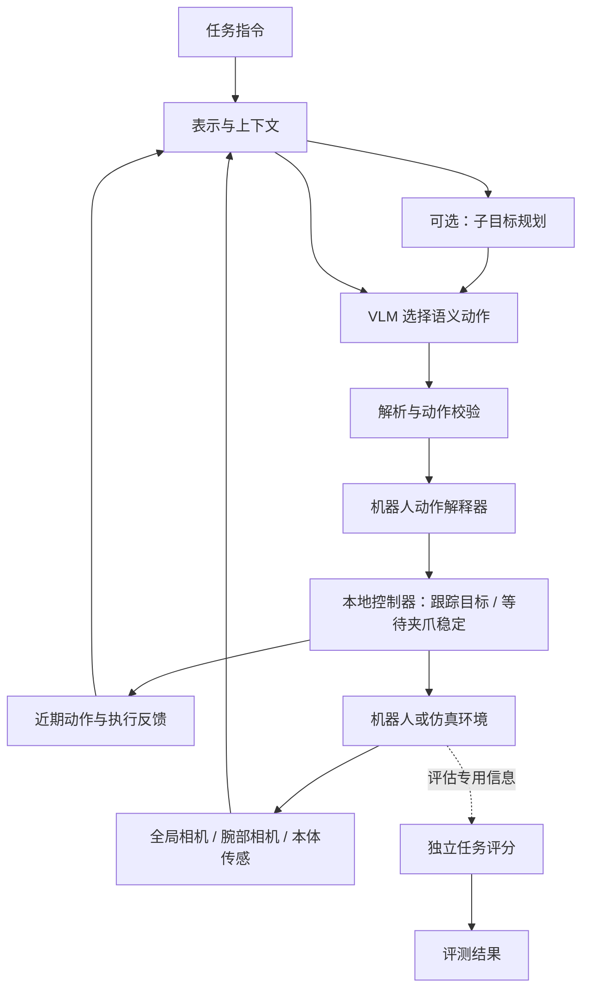
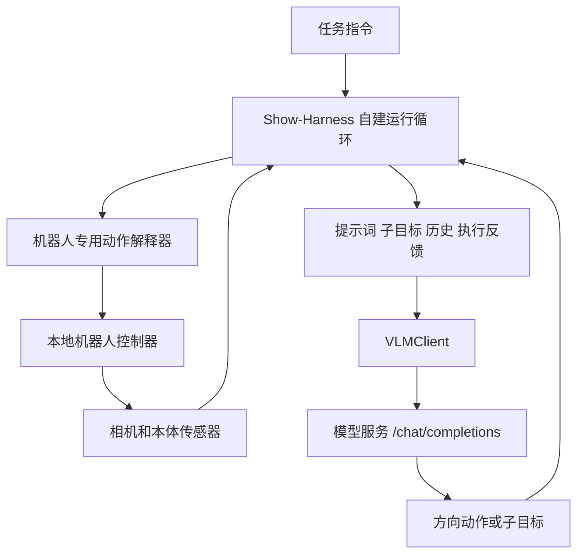

# Show-Harness 工程分析：VLM 如何控制机器人，以及 ManiLoop 如何采用

> 分析日期：2026-09-16。本文是源码审阅与工程设计报告，不是复现实验报告。
>
> 论文：[Show-Harness: Just a VLM Agent Can Play Robots，arXiv:2609.10522v1][paper]。
> 源码：[showlab/Show-Harness，固定提交 137d5718][sh-repo]（2026-09-10）。
> ManiLoop 对照版本：`e3fcb0e`。文中“现有”指此版本；“建议／拟新增”尚未实现。

## 1. 结论与采用范围

**最值得借鉴的是把模型的动作词、相机中看到的变化、机器人实际完成的位移绑定成可验证的协议。** Show-Harness 用一个很小的语义动作集合，让 VLM 反复完成“看图—选择动作—执行—重新看图”。机器人适配层负责把动作转成物理运动；规划、历史、本体反馈和恢复机制改善上下文。核心入口可沿 [动作定义][sh-actions] → [控制角色][sh-roles] → [闭环运行器][sh-runner] → [物理解释器][sh-interpreter] 阅读。

对 ManiLoop 的建议是增加一个可选的 `semantic9_v1` 策略协议，复用现有 MuJoCo／LIBERO 后端和目标执行器。先跑通单动作闭环，再按实验结果增加辅助机制。无需为了采用这个思想先迁移到另一种仿真器，也无需先训练大模型。

必须保留以下边界：

- 测评对象仍是“模型 + 表示 + 动作接口 + 控制器 + 辅助机制”的完整配置。
- 云端 VLM、微调后输出离散动作的 VLM、连续动作 VLA、ACT／Diffusion 视觉模仿策略分别标记；共享环境与记录接口，不强行统一模型输入输出。
- 策略只读传感器与允许的标定信息。物体真值、任务成功谓词和奖励留在独立评估侧。
- Show-Harness 的论文结果不能直接成为 ManiLoop／LIBERO 的预期成功率；本次没有运行其模型、真机或仿真闭环。

**关于厂商 agent 的补充结论：主路径由作者自建 harness 直接调用模型 API；GUMI 另支持外部浏览器 agent。两者应分开评测，具体调用证据和信息边界见第 3.4–3.8 节。**

## 2. 阅读范围与证据等级

| 标记 | 本文含义 | 可据此得出的结论 |
|---|---|---|
| 源码事实 | 在固定提交中检查了实际实现、配置或提示词 | 可以描述该版本的行为；不能证明所有配置均已运行成功 |
| 论文报告 | 作者在论文中的实验设置或结果 | 可以说明作者提供了哪些证据；不能视为我们的复现 |
| 上游记录 | 仓库注释／文档报告的硬件测量 | 可以识别需要标定的参数；数值不能直接搬到另一台机器人 |
| 工程建议 | 为 ManiLoop 提出的接口、实验与交付顺序 | 属于待实现和验证的设计 |

本次检查了动作定义、零样本与微调两条单臂路径、API 客户端、物理解释器、主要插件、仿真适配说明及训练／采集入口。双臂代码仅用于界定扩展范围，不宣称完成双臂全链路审计。论文的架构图、主要结果表和动作约定消融图已同时核对文字与页面图像，避免只依赖 PDF 文本提取。

### 2.1 论文中与决策最相关的少量结果

作者报告：十个抓放任务中，零样本与微调版本平均成功率分别为 89% 和 86%；动作表示消融中，有明确约定的语义标签、带约定的任意符号、无约定的任意符号分别完成 20/20、19/20、1/20。跨环境表的两列平均值覆盖项目不同；跨具身体微调使用了两个平台的数据，不能解读为未见机器人的零样本迁移。见论文第 10–11 页与第 16 页。[论文原文][paper]

**我们的推论：优先投资清楚的动作约定与可检验的执行语义，而不是只更换模型或动作名字。** 同时，模型、控制器、相机和人工规则都可能贡献成绩，ManiLoop 应逐项记录、分组比较。

## 3. 实际控制架构

以下图根据源码重绘；右侧评分分支是 ManiLoop 应保持的边界，不代表上游所有真机入口都已有独立评分。



### 3.1 零样本云端路径

单臂路径主要由 `core/runners/real.py` 组织：

1. 初始化机器人与观测；规划器在启用时根据任务和图像生成子目标。
2. 取当前阶段，构造任务、目标、抓取部位、完成条件、近期动作、本体信息和恢复提示。
3. 控制角色读取全局与腕部图像，输出一个语义动作，或在启用动作块时输出短序列。
4. 解释器把动作变为有界 TCP 运动／夹爪命令；执行后重新采集。
5. 更新历史；根据模型的阶段结束声明或恢复事件推进／回退阶段。

模型始终参与细粒度方向选择。这里的 `MV_LEFT` 不会自己搜索物体、规划完整路径并完成抓取；但系统确实提供了人工编写的相机选择、对齐和抓放规则，因此也不能把成绩归因于一个完全没有辅助设计的基础模型。[运行器][sh-runner]、[控制提示词][sh-prompt]

### 3.2 微调路径是另一套较短的闭环

`MvTokenController` 与 `core/runners/mvtoken.py` 去掉了子目标规划器和阶段状态机。每步按固定顺序传入 agentview、wrist 两张图，再附任务和最近移动，模型返回一个动作词。这个差异很重要：**零样本完整系统和微调精简系统不是只替换了权重的相同实验条件。** [微调角色][sh-ft-role]、[微调运行器][sh-ft-runner]

### 3.3 两种时钟

VLM 决策时钟与本地控制时钟分开：云端请求完成后，本地控制器完成一次有界运动，再生成下一轮观测。VLM 不承担电机伺服频率下的反馈控制。

这与 ManiLoop 的 `tcp_target_servo_v2` 方向一致。现有 `PoseTarget` 只在开始时捕获一个目标，随后根据最新本体状态计算剩余误差，并检查位置、旋转和速度是否稳定。应继续复用它，避免把“向前 2 cm”误写成每个物理步都再次向前增加 2 cm。[现有目标执行器](../../src/maniloop/controllers/target.py)、[LIBERO 适配器](../../src/maniloop/backends/libero/environment.py)

### 3.4 三个层次：模型、harness 与机器人执行器

| 层次 | 做什么 | Show-Harness 主路径中的实现 |
|---|---|---|
| VLM | 识别图像、理解任务、产生子目标、判断下一步方向 | 云端模型 API，或本地微调 VLM 服务 |
| Harness / agent runtime | 组织输入、调用模型、保存历史、推进阶段、处理异常、决定何时再次观察 | 仓库自己的 Python runner、roles 和 plugins |
| 机器人执行器 | 把符号动作转换为坐标增量、目标位姿和夹爪命令，读取执行反馈 | 仓库的 interpreter 与机器人底层接口 |

“agent”在这里指**模型与运行循环组合后的系统**，不是天然指某个厂商提供的应用。调用一个能推理的模型，也不会自动获得某个 agent 产品的工具、记忆、浏览器、权限管理和任务循环；这些能力必须在调用链中实际存在。

### 3.5 主路径：作者自己的 harness，直接请求 VLM

下面是依据源码整理的调用关系，不是论文图的复制：



可沿以下文件逐级核实：

1. [`scripts/run_real.py`][agent-sh-entry] 组装会话、模型客户端、控制器和运行器。
2. [`core/launch.py`][agent-sh-launch] 中 `make_vlm_client()` 创建 `VLMClient`，`make_runner()` 创建 `SubgoalPlanner`、`Controller` 和 `RealEpisodeRunner`。
3. [`core/runners/real.py`][agent-sh-runner] 决定何时观察、何时请求模型、何时执行和切换阶段。
4. [`core/vlm/vlm_client.py`][agent-sh-client] 中 `_post_chat()` 用 `requests.Session.post()` 请求 `base_url + "/chat/completions"`。
5. [`interpreters/real_atomic_controller.py`][agent-sh-interpreter] 将选出的动作落到真实位姿和夹爪控制。

这条已核对的主调用链没有插入 Codex CLI、Claude Code CLI 或它们的 agent runtime。配置项中的 `chatgpt` 是该仓库给模型后端起的名称，实际对应 API 参数；不能据此理解为正在操控 ChatGPT 应用。[后端配置][agent-sh-config]。

**推理能力与循环管理也应分开：**模型可以在一次请求内推理出“先接近，再下降”；但保存阶段、再次拍照、发起下一次请求，以及判断请求是否过期，都是 harness 的程序逻辑。上游多个 role 也是围绕模型调用封装的角色，并不意味着背后调用了多个现成厂商 agent。

### 3.6 可选路径：外部浏览器 agent 操作 GUMI

GUMI 是作者提供的机器人网页操作面板。官方说明明确允许把操作提示交给一个 computer-use agent，让它循环截图、操作按钮/按键、检查步数。因此这条路径可以利用**外部 agent 自带的截图、页面操作和任务循环能力**。[GUMI 使用说明][agent-sh-gumi]。

```text
外部浏览器 agent（其模型 + 其运行循环）
    → 观察并操作 GUMI 网页
    → GUMI 将按钮/按键转换为语义动作
    → Show-Harness 机器人解释器
    → 机器人
```

源码 `gumi/gpt_operator/operator.py` 的开头提到了此前使用 Claude 浏览器扩展截图和点击的方式。这是外部 agent 使用的具体线索；**Claude 浏览器扩展不等于 Claude Code**，该注释也不是主实验通过 Claude Code/Codex 执行的证据。[GPT operator 源码][agent-sh-gpt-operator]。

仓库还提供另一个容易混淆的入口：`gpt_web_operator.py`。它虽然叫 GPT Operator，但实际是作者自己实现的循环：通过 HTTP 读取相机图像和状态，调用同一个 `VLMClient` 得到结构化决定，然后向 GUMI 的 `/api/step` 发动作。它绕开浏览器点击，不是调用一个名为 Operator 的厂商成品 agent。[入口实现][agent-sh-gpt-entry]、[决策与 HTTP 执行][agent-sh-gpt-operator]。

因此应分别记录三类配置：

| 路径 | 谁管理 agent 循环 | 谁连接机器人 | 评测时应归因给谁 |
|---|---|---|---|
| 主路径：VLM API → Show-Harness | Show-Harness | Show-Harness interpreter | 模型 + Show-Harness 配置 |
| GPT Web Operator → GUMI | Show-Harness 的 GPTWebOperator | GUMI + interpreter | 模型 + operator 配置 + GUMI |
| 外部浏览器 agent → GUMI | 外部 agent 产品/框架 | GUMI + interpreter | 外部 agent 版本、模型、浏览器工具 + GUMI |

**对用户疑问的直接回答：主路径主要对应“他们自己写了一个 harness 来适配 VLM 和 robot”；另外开放了“现成浏览器 agent 操作 robot”的可选入口。不能把这两种配置混为一谈。**

### 3.7 GUMI 模拟演示不等于纯传感器评测

`GPTWebOperator.compact_model_state()` 没有转发包含模拟物体坐标的 `sim_scene`，但保留了 `task_done`、`can_stop` 等字段。单臂网页后端在模拟场景中将 `task_done` 直接设为 `scene.task_success()`，再把这些状态写入模型提示。因此，这一路径虽然过滤了几何真值，仍然向模型提供了成功判定及其派生门控信号。[状态允许列表][agent-sh-gumi-state]、[完成状态来源][agent-sh-gumi-done]。

真机分支的对应判断是“记录到至少一次放下”，这是操作启发式，不是可靠的目标完成评分。外部浏览器 agent 也可能读到网页显示的完成状态。这个发现仅针对已核对的 GUMI 入口，不能外推为论文主 runner 必然泄漏真值。

ManiLoop 若复用这种交互方式，必须给策略和用户页面分别构造状态：策略只看到允许的传感信息；任务评分、隐藏状态和停止门控留在评测管理侧。否则比较的是获得额外反馈的 agent，而不是预定的传感器赛道。

### 3.8 ManiLoop 如何支持这一区分

建议将“模型服务”与“策略运行方式”分成两个配置维度：

- `provider`：API 协议、地址、模型、请求参数。
- `agent_runtime`：单次视觉动作、自建规划循环、外部 agent 适配器。
- `action_interface`：数值 TCP、语义动作、原生连续动作块。
- `assistance`：记忆、恢复、图像标注、人类介入等。

首版继续走自建循环。未来若接外部 agent，可以提供受限的 `observe / act / finish` 接口，由 ManiLoop 统一执行和记录；工具调用后返回新的传感观测，禁止 agent 获取仿真对象真值。届时另建实验组，不以“同一个 GPT 模型”宣称两个系统完全等价。接入工具服务本身也不等于复用了厂商 agent，只有外部 runtime 真正运行才算。


## 4. 给 VLM 看什么，以及这些信息从哪里来

### 4.1 上游零样本控制上下文

| 内容 | 来源与作用 | 工程上需要明确的边界 |
|---|---|---|
| 任务文本 | 用户指令 | 不附隐藏的官方解题步骤 |
| 全局图像 | 观察目标、机械臂和场景关系 | 相机视角、裁剪、翻转必须固定并记录 |
| 腕部图像 | 近距离对齐夹爪与抓取部位 | 腕部图像的左右不天然等于机器人基坐标左右 |
| 子目标 | 规划 VLM 生成 target、affordance、motion、description、completion | 是模型假设，可能有误，不是真值 |
| 本体反馈 | TCP 高度、夹爪宽度、上一下降的实际位移等 | 区分测量值、命令值、基于阈值的推断 |
| 近期动作 | 控制历史或插件记忆 | 必须知道记录的是请求动作还是实际执行动作 |
| 恢复提示 | 夹爪宽度阈值和阶段状态判断 | 是额外控制辅助，需要计入策略配置 |
| 方向约定 | 人工编写、与机器人／相机配置配套 | 需要标定依据和版本，不能临时凭语言猜测 |

依据：[子目标结构][sh-types]、[控制提示词][sh-prompt]、[本体提示插件][sh-proprio]、[恢复插件][sh-recovery]。

### 4.2 它如何降低视觉到动作的难度

上游提示词不只说“完成任务”，还规定了视觉伺服策略：抓取阶段且目标进入腕部视野时，主要按腕部图像里目标相对夹爪的最大偏差选方向；其他情况主要看全局图像。对齐、下降、抓取、释放、退让各有提示规则。[控制提示词][sh-prompt]

这种设计把一次决策缩小为“下一步朝哪个方向更合理”，避免要求模型从两张 RGB 图中直接恢复精确三维位置、求逆运动学并预测动力学。代价是动作更粗，需要多次观察，而且提示词中的相机映射属于系统先验。

**不能原样复制这些方向文字。** 例如上游某视图把图像下方对应到 `MV_FWD`；换相机位置、图像翻转或机械臂安装方向后，对应关系可能改变。ManiLoop 应用同一份标定配置生成动作解释与提示说明，使二者保持一致。

### 4.3 ManiLoop 的允许输入

建议在现有 `SensorRepresentation` 之后增加一层表示构造，输出模型可读的上下文，不修改传感器边界来容纳任意字段：

- 原始 RGB 图像及相机名称；可选坐标轴说明由相机标定生成。
- 机器人本体可测量的 TCP／关节／夹爪状态，以及已执行动作的真实反馈。
- 固定、公开的动作定义与标定版本。
- 由模型从图像得到的目标描述或置信度，但标记为 `inferred`。
- 从固定桌面标定得到的高度约束，可作为公开场景标定；动态物体高度不能从仿真对象状态偷取。

当前 LIBERO 是 RGB 协议，不能因为自建桌面有深度查询接口就给 LIBERO 自动增加深度。若未来新增 RGB-D 赛道，需要单独命名并与 RGB 赛道分组。传给模型的图像也不能含基于物体真值绘制的框、距离、接触点或任务完成标志。[现有传感器允许列表](../../src/maniloop/core/observations.py)、[表示边界](../../src/maniloop/representations/sensors.py)

## 5. 动作接口：语义必须落到物理量

### 5.1 词表与配置不是同一层

上游基础动作包含六向平移、夹爪开合、结束，以及可选旋转／停止。单臂微调的默认词表是九项：六个 `MV_*`、`GRASP`、`RELEASE`、`DONE`。它们是模型生成的文本标签；这条路径没有新增连续动作预测头，也不要求新增九个 tokenizer 特殊词。[动作定义][sh-actions]、[微调角色][sh-ft-role]

以下只是上游 **Franka 配置**，不是所有机器人通用坐标：

| 词 | 基坐标中的配置方向 |
|---|---|
| `MV_FWD` / `MV_BACK` | +X / −X |
| `MV_LEFT` / `MV_RIGHT` | −Y / +Y |
| `MV_UP` / `MV_DOWN` | +Z / −Z |
| `GRASP` / `RELEASE` | 请求夹爪关闭／打开 |
| `DONE` | 模型声明阶段或任务结束，不产生位移 |

基础步长是 0.02 m；零样本配置还设置了 0.04 m 粗步长和独立的上升步长。旋转插件默认关闭；所检查的单臂真机解释器主要改变绕基坐标 Z 轴的 yaw，不能据此宣称任意六自由度姿态控制已经统一支持。[Franka 动作配置][sh-primitives]、[运行配置][sh-config]、[解释器][sh-interpreter]

### 5.2 解释器怎样执行一次移动

`RealAtomicController.step()` 的关键行为：

1. 解析动作词，选择本次步长和参考坐标系。
2. 把移动向量限制在允许范围内，累加到内部 TCP **目标设定值**。
3. 应用最低高度限制；必要时进行腕部方向或 yaw 补偿。
4. 驱动本地机器人接口到目标，采集执行后 TCP 位姿。
5. 返回动作、期望增量、执行前／后位姿、目标位姿、夹爪状态等记录。

因此“解释器确定性”表示同一输入按规则生成命令，不表示机器人实际位移严格相同。内部目标连续累加也不等于每次都从实际到达的位置重算；遇到接触或追踪失败，目标与实际状态可能拉开。[解释器的 step 与运动执行][sh-interpreter-step]

ManiLoop 应以当前传感器状态捕获每次固定目标，并把 `reached`、`timed_out`、`interrupted` 等结果反馈给模型。超时不能被历史记录压缩成“已向前移动 2 cm”。如未来采用连续设定值积分，还应显式设计误差上限和重新同步规则。

### 5.3 夹爪关闭不等于抓取成功

上游会等待夹爪宽度趋稳，针对“闭合后过窄”自动重新打开；恢复插件还可回到抓取阶段。这解决了夹爪异步运动导致的过早观察问题，但宽度只能给出启发式证据：薄物体、夹到环境或机构限制都可能造成误判。[夹爪执行][sh-interpreter-grip]、[恢复插件][sh-recovery]

建议使用 `gripper_settled`、`empty_grasp_likely` 等状态；不把中等宽度直接升级成“已确认抓住目标”。最终成功仍由独立任务评估决定。

### 5.4 标定是接入的交付物

上游仿真配置报告：ManiSkill 使用命令步长 0.026 m 和两个控制步来获得约 20.2 mm 实际位移；RoboLab 配置使用 0.072 m 命令补偿其控制响应，以得到约 20.1 mm。**这是作者对特定配置的测量记录，不是本次测量，也不是 ManiLoop 应照抄的增益。** [ManiSkill 配置][sh-maniskill-config]、[RoboLab 配置][sh-robolab-config]

ManiLoop 每个机器人／控制器组合应输出：

- 六方向小步测试：请求位移、实际位移、正交误差、到达时间、残差。
- 不同工作区位置的重复测试，覆盖易接近关节极限的位置。
- 相机前后图：检验视觉方向与动作定义是否一致。
- 夹爪打开／关闭、空夹及持物的传感响应；用于定义有限的测量阈值。
- 相机变换、动作坐标、控制参数、源版本与报告哈希。

固定末端姿态的首版可采用简单方向表。若允许大幅旋转末端或移动相机，原先图像方向关系可能失效，需要姿态相关变换或新的观测表示；在验证前不应默默复用旧表。

## 6. 辅助机制的收益、成本和采用顺序

| 机制 | 上游如何实现 | ManiLoop 建议 |
|---|---|---|
| 相机使用说明 | 明确全局定位与腕部对齐的角色 | 第一版提供；每个相机 profile 单独核验 |
| 本体上下文 | 高度、宽度、下降实际进展等文本 | 第一版提供可靠测量，区分命令与测量 |
| 动作历史 | 短窗口保存移动和上下文 | 第一版保留有限已执行历史，不塞满日志 |
| 子目标规划 | VLM 输出阶段及可视完成条件 | 第二阶段加入；单独记录规划调用与错误 |
| 自动恢复 | 宽度判据、自动打开、阶段回退、阻止 DONE | 后续消融项；干预动作单独归因 |
| 可变步长 | 根据高度和 VLM 的腕部可见性判断选择粗细 | 固定步长基线之后再加入 |
| 动作块 | 目标未进入腕部视野时解析最多若干个 `MV_*` | 单步稳定后再加入，保留中止点 |
| 视觉标记 | 对抓取部位添加视觉提示、可做额外验证 | 后续表示实验；只能来自传感推断 |
| 情境重规划 | 根据执行中观测更新后续阶段 | 长任务阶段再做，限制重规划预算 |
| 平滑／人工接管 | smooth 插件和 DAGGER 入口 | 人工采集与协助赛道，不混入自主成绩 |

依据：[插件组织说明][sh-plugins]、[可变步长][sh-variable]、[动作块][sh-chunk]、[恢复][sh-recovery]、[默认配置][sh-config]。

动作块需要特别谨慎：上游允许一次推理返回最多三次移动，序列中可以重复相同方向；它不是每个物理步自动重复一个连续增量。队列执行期间虽然运行器还能采集观测，并受恢复／人工接管打断，但不会因为目标“可能刚进入腕部画面”就必然重新调用 VLM 更新可见性。可见性门控和中途重新感知是两件事。[动作块解析][sh-chunk]、[队列执行路径][sh-runner]

工程判断：云端延迟越高，少调用的收益越大，但接触附近的开环误差也越危险。ManiLoop 首版用一次推理、一个动作；后续先尝试长度 2 的纯平移块，抓取／释放前强制重新观察，并把块长度写入比较组。

## 7. 不能直接照搬的实现细节

### 7.1 成功字段的语义不统一

零样本 `RealEpisodeRunner` 将最后子目标的 `DONE` 变成 `plan_complete`，随后置 `success=True`。微调运行器则在 `DONE` 时记录 `end_reason="done"`，保留 `success=False`，因为真机没有环境成功检查。这两个布尔值都不能直接当作统一的 benchmark 成绩。[零样本结束路径][sh-runner-success]、[微调结束路径][sh-ft-success]

ManiLoop 应分别记录：

- `model_reported_done`：模型是否认为完成。
- `termination_reason`：模型结束、预算、故障、人工停止等。
- `evaluator_success`：独立官方评价，真机未评价时为 `null`。
- `evaluation_status`：已评分、不可评分或基础设施故障。

### 7.2 阶段超时可能直接进入下一阶段

上游零样本运行器遇到阶段步数上限时，会把子目标索引加一。这有利于演示持续运行，但不证明阶段完成。ManiLoop 应记录 `stage_budget_exceeded`，结束或按预先声明的重规划规则处理，不能把索引前进视为成功证据。[阶段预算路径][sh-runner-stage]

### 7.3 解析失败后仍可能发出移动

控制角色在两次解析／回退尝试失败后，可选择上一移动方向；没有上一方向时，回退候选为 `MV_DOWN`。底层解释器遇到未知 token 会保持位置，但上层把错误改成合法移动后，底层就无法知道它来自解析失败。[回退候选][sh-fallback]、[回退函数][sh-fallback-call]

ManiLoop 建议：非法、不完整、过期或与观测 ID 不符的响应不生成动作；保持当前目标并结束该次自主执行。将错误作为通信／策略协议故障记录。若研究容错策略，另建明确的配置和实验组，不能伪装成模型选择。

### 7.4 API “兼容”不等于协议、约束和计费相同

检查到的上游统一客户端发往 `/chat/completions`；它会按供应商调整请求字段，并将 `guided_json` 转换为 `response_format={type: json_object}`。后者不等于严格 JSON Schema 校验；token 恢复和格式重试仍存在。配置中还可启用多次网络重试。[供应商参数处理与请求][sh-client]、[角色解析][sh-roles]、[配置][sh-config]

ManiLoop 已提供 Responses 与 Chat Completions 聊天诊断，但机器人入口还需要逐级验证双图和动作 schema。不能因为文字聊天通过，就假设图像支持、结构化返回和动作执行也通过。[聊天说明](../API_CHAT.md)

建议把总调用拆成 planner、controller、视觉标记、格式重试、网络重试等用途。一次机器人决策可能产生多次 API 请求；只累加最终返回对象的耗时和 token 会漏算。尤其上游角色的兜底返回会写 `latency_s=0.0`，不能用它代表前面的失败成本。[回退实现][sh-fallback-call]

### 7.5 默认文件不是完整复现实验配置

论文设置的步数上限为 50，而公开 Franka 默认配置为 200；论文附录训练为 40 epochs，公开 Qwen 训练模板为 30。模板还写有 `freeze_multi_modal_projector: false`。因此必须保存最终解析后的配置与实际可训练参数清单，不能仅凭模板注释声称完全复现。[论文设置与附录][paper]、[运行配置][sh-config]、[训练模板][sh-train-config]

默认配置还允许加载未随公开仓库提供的可选本地覆盖文件。要复现某个成绩，应获取对应运行的最终配置、模型版本和轨迹，而不是只启动默认 YAML。

### 7.6 最低高度不是完整安全控制器

最低 TCP 高度只约束一个方向，不能保证连杆不碰撞、不夹伤、不越关节边界或双臂不相撞。腕部参考系退化时的自动回退也可能改变动作含义。迁移真机需要设备侧限速、工作区和碰撞限制、传感超时处理、独立停止链路；这些属于本地执行层，不能依赖云端模型及时响应。[物理解释器][sh-interpreter]

## 8. 仿真、微调与数据闭环

### 8.1 上游仿真支持不等于 LIBERO 兼容

检查到的物理仿真接入是 **ManiSkill／SAPIEN** 和 **RoboLab／Isaac Lab**。其中 RoboLab 路径还调整了手指外观／碰撞几何和腕部相机，以贴近其真实机器人。网页 `gumi --sim` 使用 OpenCV 绘制合成桌面，抓取与放置由简化规则决定，不能作为 MuJoCo 接触物理验证。[仿真说明][sh-sim]、[合成桌面实现][sh-toy]

ManiLoop 可以采用其接口思想，继续使用已有 LIBERO 官方后端；不必安装这些上游仿真依赖。若以后接入 ManiSkill／RoboLab，应各自成为可选后端。相机、资产或控制器一旦发生变化，结果必须明确标为对应协议，不能自动称为原始官方 benchmark 设置。

此外，RoboLab 的完整任务目录和上游演示生成器的支持集合不同：该生成器主要覆盖可解析的单物体抓放任务，其他类型会拒绝。目录能列出任务，不等于采集、训练、控制和评分全链路都已覆盖。[仿真文档][sh-sim]、[RoboLab 演示生成器][sh-robolab-oracle]

### 8.2 微调的是“看图选择动作词”

上游 Qwen 配置采用 LoRA、SFT 与图像文本训练格式。动作标签进入语言模型输出；部署时保持训练对应的相机顺序、提示模板、图像处理和历史定义。`MvTokenController` 的解析器检查输出词表，而不是用解码约束掩盖模型是否学会输出格式。[训练模板][sh-train-config]、[微调角色][sh-ft-role]

特别容易忽略的是：已发布单臂适配器采用 v3 提示协议；Piper 混合训练数据存在前后词交换，部署需在执行边界使用 `execution_token_swap`，模型历史保留训练时的词义。新提示模板存在于仓库，不代表已有匹配训练权重。[微调部署说明][sh-ft-doc]

对 ManiLoop 而言，连续动作 VLA 的归一化、动作块、历史帧、控制频率仍应保持各检查点训练协议。不能把 SmolVLA 输出临时量化成九个词后，还当成原来的官方模型结果。若研究这种量化，应新增适配协议与实验组。

上游默认模型服务和训练配置也不能证明在本机 Apple MPS 上可运行。本报告不要求先下载或训练该模型；云端语义动作验证是较短的第一步。

### 8.3 GUMI 数据记录值得借鉴，但还需要工程补强

采集端先记录决策前观测与所选动作，再执行；这样训练标签对应模型当时可见的信息，而不会把动作后的图像误配到之前的动作。[GUMI 记录与执行][sh-gumi]

ManiLoop 后续可采用下列记录结构。此为建议 schema，不是已存在格式：

```text
episode_id / step_id / observation_id / capture_time
observation: camera files + robot proprioception
instruction + representation_id + calibration_id
proposed_action + source(model / human / scripted_teacher)
validated_action + executed_action + intervention_reason
pre_state + target_state + post_state + execution_status
API request references + usage + latency + unknown_usage flags
label_status(pending / executed / rejected / execution_failed)
```

先写 pending，再在执行结束后补齐状态；执行失败的数据不能因“已记录标签”就自动进入成功示范集。保存人工纠正时要同时保留原模型提议和实际动作，不把纠正后的成绩标为纯自主。

上游仿真 oracle 明确读取物体位姿来生成演示。它可以是训练数据教师，但不是 sensor-only 策略；教师权限、数据来源和过滤规则应写入训练清单，训练／验证／测试按 episode 和任务划分，不能随机打散相邻帧造成泄漏。[ManiSkill oracle][sh-maniskill-oracle]

固定策略评测期间不得用测试结果在线修改权重、提示词或恢复规则后继续合并统计。学习、采集和评测沿用 ManiLoop 已确认的独立模式。

## 9. ManiLoop 的最小工程方案

### 9.1 保留现有责任边界

| 现有文件／对象 | 当前职责 | 本次设计如何复用 |
|---|---|---|
| `core/observations.py`、`SensorRepresentation` | 传感器字段允许列表 | 继续阻止评估真值进入策略 |
| `core/actions.py` | 物理动作和 VLA 动作块 | 保留原有动作协议；语义动作在独立适配层转换 |
| `agents/llm.py`、`providers/responses.py` | 云端策略与请求处理 | 抽出可复用传输能力，按策略选择不同输出 schema |
| `controllers/target.py::PoseTarget` | 固定目标的本体反馈控制 | LIBERO 语义平移复用它，不重写官方 OSC |
| `backends/libero/environment.py` | 官方环境、控制器与隔离接口 | 保持官方初始化和独立评分 |
| `runtime/runner.py::EpisodeRunner` | 生命周期、时序、预算、日志 | 增加明确的策略入口，避免堆入规划与恢复实现 |
| `recording/manifest.py` | 来源与比较组 | 增加语义协议、标定、提示与辅助配置摘要 |
| `agents/lerobot/` | 本地学习策略 | 保持现有模型输入处理与原生动作节奏 |

首版仍采用显式构造的小对象，不引入动态插件发现框架。上游把插件实现与提示片段放在一起是有价值的组织方式，但大运行器中的阶段推进、恢复、人工接管和动作队列耦合不应整段搬入 ManiLoop。

### 9.2 拟新增的文件

下面是实施清单，文件尚未创建：

```text
src/maniloop/
  core/semantic_actions.py       # SemanticDecision、固定词表、校验
  representations/view_guidance.py  # 由标定生成相机说明和上下文
  agents/semantic_vlm.py         # 实现现有 Agent 协议，组合请求与解释器
  controllers/semantic.py        # SemanticInterpreter：词 -> 现有物理 Action
  # 第二阶段再新增 agents/planning.py / agents/recovery.py
configs/semantic/               # 使用项目已有配置格式，以下 YAML 只是示意
  libero_panda_fixed_v1.*
  tabletop_panda_fixed_v1.*
  tabletop_arx5_fixed_v1.*
scripts/probe_semantic_actions.py # 无付费 API 的标定与方向检查
```

`SemanticVlmAgent` 负责模型提示与决策解析；`SemanticInterpreter` 只接受校验通过的语义动作、传感器快照、机器人能力和标定。解释器不持有环境对象，也不读取任务评分。规划和恢复以组合对象提供上下文／干预请求，运行器只负责调度。

当前 `Agent` 返回字典或 `ActionChunk`。第一版可由新 Agent 在内部完成语义校验与转换，再返回运行器已有的物理动作字典，同时提供结构化决策元数据供日志记录；不要为此一次重写所有 Agent。对 `core/actions.py` 的既有接口只做确有必要的兼容扩展。[现有 Agent 接口](../../src/maniloop/agents/base.py)、[现有运行器](../../src/maniloop/runtime/runner.py)

### 9.3 第一版协议示例

建议策略只输出以下三项，额外字段拒绝；这是 ManiLoop 的拟定协议，不是上游原始 API：

```json
{
  "observation_id": "episode-0001:step-0042",
  "action": "MV_UP",
  "reference_frame": "world"
}
```

协议规则：

1. `action` 是九项枚举。`DONE` 只结束模型决策，不改写评分。
2. frame 必须匹配当前 profile；模型不能自由发明或切换坐标系。
3. 位移量由实验配置确定。第一版建议固定 0.02 m、固定姿态、一个动作；先在无障碍探针中验证，再进入任务。
4. 夹爪单独执行，保持已有 TCP 目标；等待本体稳定后才继续。
5. 响应完整性、schema、观测 ID、回合版本和过期检查全部通过才能执行。
6. 动作映射、标定 ID、原始有效决策、转换后动作和最终反馈同时写入事件记录。
7. `STOP` 可作为本地控制状态，但不挤入这个九动作模型词表；未知输出不自动替换为移动。

固定 2 cm 并不保证能完成所有 LIBERO 任务。窄容器、精细放置或需要旋转的任务可能暴露动作表达能力不足；这应成为结果，而不是临时改任务容差。后续可测试 1 cm、可变步长或受限旋转，各自保留版本。

### 9.4 配置示意

以下键名和数值是设计建议，不能直接当成当前 CLI 的可用配置：

```yaml
protocol: semantic9_v1
policy_family: vlm_semantic_cloud
provider: user_selected_connection
observation_profile: libero_rgb512_proprio_v2
calibration_id: required_measured_profile
reference_frame: world
translation_step_m: 0.02
orientation_mode: hold_initial
execution_adapter: tcp_target_servo_v2
history_executed_actions: 5
planner: false
automatic_recovery: false
action_chunk_length: 1
format_retries: 0
network_retries: 0
timing: controlled
evaluation_source: official_libero
human_intervention: disabled
budgets:
  max_model_decisions: 50
  max_api_requests: 50
  max_control_steps_per_action: 20
  max_wall_seconds: 1200
  max_sim_seconds: 60
```

这些预算是首轮建议上限，不是预估耗时或论文复现参数；任一预算耗尽都记录具体原因。真实比较时必须预先冻结最终值。控制器每步上限等设置需要与实际 `PoseTarget.description()` 校验，不能在配置中声明一个实现没有执行的数值。

若增加规划器，API 预算需要包含规划请求。若改用实时模式，云端推理期间环境继续变化，必须重新检查观测年龄、回合版本及必要的中止条件，结果单独分组。

### 9.5 一次决策的伪代码

```python
# 设计伪代码；不是当前仓库可直接运行的函数。
snapshot = sensors.capture_synchronized()
packet = sensor_boundary.encode(snapshot.public_observation)
context = representation.build(task, packet, images=snapshot.images,
                               history=executed_history, calibration=profile)
response = provider.generate(context, schema=semantic_schema)
request_log.record(response)  # 含失败耗时；未知 token 用量保留 unknown
semantic = validate_complete_response(response, snapshot.id, episode_version)

if semantic.action == "DONE":
    terminate(reason="model_done")
else:
    action = interpreter.translate(semantic, packet, profile)
    execution = backend.execute_bounded(action)  # 内部复用本地反馈控制
    decision_log.record(semantic, action, execution)
    executed_history.append(execution)          # 不把 accepted 当 reached

# 评估位于独立结果通道；其内容不进入下一轮 context。
results.record(evaluator.evaluate())
```

工程实现仍使用现有异步运行器：重置／停止之后返回的旧请求必须丢弃，不能让上述简写变成阻塞 UI 或绕过当前回合校验的理由。

## 10. 实施里程碑与验收标准

按“先完成，再完善”推进，每个里程碑独立提交，并更新工作记录。

| 阶段 | 交付内容 | 通过标准 | 不作为通过标准的内容 |
|---|---|---|---|
| P0 通信与图像 | 现有聊天之后，验证单图、双图和动作格式诊断 | 每次请求能区分传输、格式、内容错误；诊断不步进物理 | 文字回复成功不能代表模型看到了图 |
| P1 可解释单动作 | 九动作协议、标定脚本、语义 Agent、一个任务入口 | 六向符号正确；固定目标到达／超时可见；无效响应不动；DONE 独立评分 | 接口能运行不等于抓取成功 |
| P2 最小模型闭环 | Panda／LIBERO 一个抓放任务；自建 ARX5 桌面一个任务 | 保存完整轨迹；至少能定位每个失败层次；如有成功保留其官方评分 | 单次成功不等于 benchmark 成绩 |
| P3 固定集合比较 | 数值 TCP 与语义动作，固定任务／初始状态 | 所有预注册 episode 有结果；无真值输入；报告预算和辅助配置 | 不因失败就删除该初始状态 |
| P4 辅助机制消融 | 规划、恢复、步长、动作块分步引入 | 每次只改一个因素；分别报告收益、调用成本和干预量 | 不把全开配置提升归因于模型本身 |
| P5 数据与小模型 | 人工／教师采集、离线 SFT、独立检查点接入 | 数据前后状态对齐；训练测试隔离；动作和相机协议一致 | 本轮不要求训练或运行 Show-Harness 权重 |

P1 建议优先复用已有的目标控制回归，新增真正保护行为的检查：六向映射、过期／非法响应不执行、目标不重复累加、夹爪状态与成功判定分离、日志不泄漏评分。只有通过本体追踪和相机方向检查后，才开始付费任务评测。

P2 可先做每个任务三个固定初始化的调试，全部结果保留。P3 再扩大到预先选定的五个任务、每任务二十个官方初始化索引；实验预算或算力不足时可以缩小集合，但在运行前固定名单。LIBERO 用 suite、task ID、init-state ID 和 seed 一起标识，seed 不能替代官方初始状态索引。

## 11. 如何证明设计更合适

### 11.1 最小对照组

| 组 | 输出接口与辅助 | 能回答的问题 |
|---|---|---|
| A | 现有数值 TCP 目标 + 相同图像／本体信息 | 当前协议基线是什么 |
| B | 固定九动作 + 明确方向约定 | 限制动作空间是否让该模型更可靠 |
| C | B + 子目标规划 | 规划是否减少任务阶段混乱，代价多少 |
| D | B + 传感器恢复 | 改善来自模型还是规则干预 |
| E | 最佳已验证组 + 可变步长／短动作块 | 节省调用是否抵消开环误差 |

A 和 B 尽量共享模型版本、提供商、相机处理、历史长度、推理强度、任务、初始状态与物理执行器。A 的动作表达范围更大，这本身就是实验变量，应公开最大位移和旋转能力，不宣称是在完全相同动作空间中仅比较标签。

VLA／ACT／DP 可以在同一任务上列出结果，但维持各自训练匹配的图像与动作协议。比较表展示输入、控制频率、训练数据声明和辅助机制，不能把不同信息条件下的结果压成“哪个模型更聪明”的单一排行。

### 11.2 结果和失败分类

每个 episode 至少记录：

- 官方成功、模型自报结束、实际终止原因及可评分状态。
- 模型决策数、所有 API 请求数、物理控制步、仿真时间和墙钟时间。
- 输入／输出 token；供应商没返回的用量保持未知，不计成零。
- API 延迟分布、格式错误、超时、拒绝响应、观测过期和控制器超时。
- 恢复次数、人工干预次数、动作裁剪／禁止次数、夹爪稳定失败次数。
- 模型／供应商标识、源版本、最终配置、提示 hash、标定 hash、相机处理、控制器与任务初始化协议。

失败应先归到可观察的层：通信 → 响应完整性 → 格式 → 动作校验 → 执行 → 感知／策略选择 → 任务未完成。不能把没有发出任何动作的 API 故障解释为“模型不会抓取”。

同时报告端到端完成率与有效执行 episode 的条件成功率，并明确两个分母；公开基础设施失败数，避免通过排除故障美化结果。任务级结果保留，汇总附样本数和区间；小样本只能支持集成与趋势判断。

### 11.3 防止评测数据泄漏

保存模型实际看到的序列化上下文清单与图像处理配置。特别检查：

- 策略输入中不存在对象位置、奖励、任务成功或 oracle 路径。
- planner、视觉标记和 recovery 也只能使用同一允许的信息边界。
- 自建场景的 GUI 调试叠加信息不被重新截图当作传感器图像。
- 错误反馈不夹带“离目标还有真值距离”或官方谓词的解释。
- 校准只定义机器人、相机和公开静态几何，不按测试物体位置定制。

## 12. 可直接进入项目管理的工作项

以下优先级是建议，尚未代表开始实现：

1. **建立六方向标定与相机说明 profile。** 输出机器可读的测量文件和人工可读的前后图；对无有效 profile 的组合拒绝运行语义策略。
2. **实现 `SemanticDecision` 和 `SemanticInterpreter`。** 九动作、固定步长、既有坐标系；输入校验失败不产生动作；转换记录可追踪。
3. **实现语义 VLM Agent 和 provider 复用。** 避免复制整套密钥／TOML／供应商处理；保留两种通信协议的能力差异和完整性检查。
4. **接入 CLI 与现有网页。** 展示原始合法动作词、物理目标、实际结果、当前相机约定；不把调试图形混入模型输入。
5. **固定小型评测清单。** 预先指定官方 task／init-state 集合、预算、策略配置与所有失败的记录方式。
6. **再建立规划／恢复消融。** 禁止默认悄悄打开人工接管、自动移动兜底或测试中学习。

首个可交付版本的范围：一个语义策略、一个经过标定的 Panda／LIBERO 配置、一条完整轨迹，以及同初始化下数值 TCP 与语义动作的可核查对照。扩展 ARX5 的工作从新的标定开始，而不是复制 Panda 的方向表。

## 13. 来源、复用方式与验证边界

本报告独立描述机制与提出设计，未复制上游实现到 ManiLoop，也未打包论文、训练集、模型或资产。上游源码声明 Apache-2.0；若后续实际复用代码，应检查并保留其许可与来源文件，单独核对模型和资产条款，不能因 ManiLoop 根目录采用 MIT 就删除第三方声明。[上游 LICENSE][sh-license]

本次已完成：固定版本源码阅读、关键论文图表核对、ManiLoop 现有接口对照、工程步骤和验收设计。**未完成且未声称完成：Show-Harness 运行复现、其检查点在本机的推理验证、LIBERO 语义策略实现、真实云端抓取成功率评测。**

与仓库已有文档的关系：[框架设计](../ARCHITECTURE.md) 定义长期边界；[LLM loop v2](../design/LLM_LOOP_V2.md) 记录数值目标控制诊断；本文提供下一轮语义动作与上下文设计的依据；实际实施进展维护到 [worknote](../worknotes/worknote.md)。

### 固定版本来源索引

以下源码链接全部固定到同一提交；正文中的精确引用还定位到关键分支。

| 阅读问题 | 主要入口 |
|---|---|
| 总体方法与作者实验 | [论文 v1][paper]、[固定源码树][sh-repo] |
| 动作怎样定义 | [词表][sh-actions]、[Franka 映射][sh-primitives] |
| 模型收到哪些上下文 | [控制提示词][sh-prompt]、[角色实现][sh-roles] |
| 一次动作怎样实际执行 | [物理解释器][sh-interpreter] |
| 模型结束怎样被记录 | [零样本路径][sh-runner-success]、[微调路径][sh-ft-success] |
| 失败响应怎样处理 | [API 客户端][sh-client]、[角色兜底][sh-fallback-call] |
| 辅助模块怎样组织 | [插件说明][sh-plugins]、[默认配置][sh-config] |
| 仿真接入与标定 | [仿真说明][sh-sim]、[ManiSkill 配置][sh-maniskill-config]、[RoboLab 配置][sh-robolab-config] |
| 训练与部署协议 | [训练模板][sh-train-config]、[微调部署][sh-ft-doc]、[微调角色][sh-ft-role] |
| 示范数据来自哪里 | [GUMI 采集][sh-gumi]、[仿真 oracle][sh-maniskill-oracle] |

[paper]: https://arxiv.org/pdf/2609.10522v1
[sh-repo]: https://github.com/showlab/Show-Harness/tree/137d5718c3b7af0150764d8f9beeb252c9f2794a
[sh-actions]: https://github.com/showlab/Show-Harness/blob/137d5718c3b7af0150764d8f9beeb252c9f2794a/core/action_units.py
[sh-roles]: https://github.com/showlab/Show-Harness/blob/137d5718c3b7af0150764d8f9beeb252c9f2794a/core/vlm/roles.py
[sh-runner]: https://github.com/showlab/Show-Harness/blob/137d5718c3b7af0150764d8f9beeb252c9f2794a/core/runners/real.py
[sh-interpreter]: https://github.com/showlab/Show-Harness/blob/137d5718c3b7af0150764d8f9beeb252c9f2794a/interpreters/real_atomic_controller.py
[sh-prompt]: https://github.com/showlab/Show-Harness/blob/137d5718c3b7af0150764d8f9beeb252c9f2794a/prompts/controller.txt
[sh-ft-role]: https://github.com/showlab/Show-Harness/blob/137d5718c3b7af0150764d8f9beeb252c9f2794a/core/vlm/mvtoken_roles.py
[sh-ft-runner]: https://github.com/showlab/Show-Harness/blob/137d5718c3b7af0150764d8f9beeb252c9f2794a/core/runners/mvtoken.py
[sh-types]: https://github.com/showlab/Show-Harness/blob/137d5718c3b7af0150764d8f9beeb252c9f2794a/core/v0_types.py
[sh-proprio]: https://github.com/showlab/Show-Harness/blob/137d5718c3b7af0150764d8f9beeb252c9f2794a/plugins/proprioception/plugin.py
[sh-recovery]: https://github.com/showlab/Show-Harness/blob/137d5718c3b7af0150764d8f9beeb252c9f2794a/plugins/recovery/plugin.py
[sh-primitives]: https://github.com/showlab/Show-Harness/blob/137d5718c3b7af0150764d8f9beeb252c9f2794a/configs/primitives_franka.yaml
[sh-config]: https://github.com/showlab/Show-Harness/blob/137d5718c3b7af0150764d8f9beeb252c9f2794a/configs/robot_franka.yaml
[sh-interpreter-step]: https://github.com/showlab/Show-Harness/blob/137d5718c3b7af0150764d8f9beeb252c9f2794a/interpreters/real_atomic_controller.py#L516-L690
[sh-interpreter-grip]: https://github.com/showlab/Show-Harness/blob/137d5718c3b7af0150764d8f9beeb252c9f2794a/interpreters/real_atomic_controller.py#L692-L755
[sh-maniskill-config]: https://github.com/showlab/Show-Harness/blob/137d5718c3b7af0150764d8f9beeb252c9f2794a/configs/robot_maniskill.yaml
[sh-robolab-config]: https://github.com/showlab/Show-Harness/blob/137d5718c3b7af0150764d8f9beeb252c9f2794a/configs/robot_robolab.yaml
[sh-plugins]: https://github.com/showlab/Show-Harness/blob/137d5718c3b7af0150764d8f9beeb252c9f2794a/plugins/README.md
[sh-variable]: https://github.com/showlab/Show-Harness/blob/137d5718c3b7af0150764d8f9beeb252c9f2794a/plugins/variable_step/plugin.py
[sh-chunk]: https://github.com/showlab/Show-Harness/blob/137d5718c3b7af0150764d8f9beeb252c9f2794a/plugins/action_chunk/plugin.py
[sh-runner-success]: https://github.com/showlab/Show-Harness/blob/137d5718c3b7af0150764d8f9beeb252c9f2794a/core/runners/real.py#L505-L610
[sh-ft-success]: https://github.com/showlab/Show-Harness/blob/137d5718c3b7af0150764d8f9beeb252c9f2794a/core/runners/mvtoken.py#L249-L268
[sh-runner-stage]: https://github.com/showlab/Show-Harness/blob/137d5718c3b7af0150764d8f9beeb252c9f2794a/core/runners/real.py#L253-L269
[sh-fallback]: https://github.com/showlab/Show-Harness/blob/137d5718c3b7af0150764d8f9beeb252c9f2794a/core/vlm/roles.py#L537-L565
[sh-fallback-call]: https://github.com/showlab/Show-Harness/blob/137d5718c3b7af0150764d8f9beeb252c9f2794a/core/vlm/roles.py#L229-L298
[sh-client]: https://github.com/showlab/Show-Harness/blob/137d5718c3b7af0150764d8f9beeb252c9f2794a/core/vlm/vlm_client.py#L133-L268
[sh-train-config]: https://github.com/showlab/Show-Harness/blob/137d5718c3b7af0150764d8f9beeb252c9f2794a/train/configs/qwen3_5_2b_lora.yaml
[sh-sim]: https://github.com/showlab/Show-Harness/blob/137d5718c3b7af0150764d8f9beeb252c9f2794a/docs/simulators.md
[sh-toy]: https://github.com/showlab/Show-Harness/blob/137d5718c3b7af0150764d8f9beeb252c9f2794a/gumi/web_teleop/sim.py
[sh-robolab-oracle]: https://github.com/showlab/Show-Harness/blob/137d5718c3b7af0150764d8f9beeb252c9f2794a/scripts/trajectory/real2sim/robolab/oracle.py
[sh-ft-doc]: https://github.com/showlab/Show-Harness/blob/137d5718c3b7af0150764d8f9beeb252c9f2794a/docs/finetuned.md
[sh-gumi]: https://github.com/showlab/Show-Harness/blob/137d5718c3b7af0150764d8f9beeb252c9f2794a/gumi/web_teleop/backend.py#L257-L265
[sh-maniskill-oracle]: https://github.com/showlab/Show-Harness/blob/137d5718c3b7af0150764d8f9beeb252c9f2794a/scripts/trajectory/real2sim/maniskill/oracle.py
[sh-license]: https://github.com/showlab/Show-Harness/blob/137d5718c3b7af0150764d8f9beeb252c9f2794a/LICENSE

[agent-sh-client]: https://github.com/showlab/Show-Harness/blob/137d5718c3b7af0150764d8f9beeb252c9f2794a/core/vlm/vlm_client.py#L189-L268
[agent-sh-config]: https://github.com/showlab/Show-Harness/blob/137d5718c3b7af0150764d8f9beeb252c9f2794a/configs/robot_franka.yaml
[agent-sh-entry]: https://github.com/showlab/Show-Harness/blob/137d5718c3b7af0150764d8f9beeb252c9f2794a/scripts/run_real.py
[agent-sh-gpt-entry]: https://github.com/showlab/Show-Harness/blob/137d5718c3b7af0150764d8f9beeb252c9f2794a/gumi/gpt_web_operator.py
[agent-sh-gpt-operator]: https://github.com/showlab/Show-Harness/blob/137d5718c3b7af0150764d8f9beeb252c9f2794a/gumi/gpt_operator/operator.py
[agent-sh-gumi]: https://github.com/showlab/Show-Harness/blob/137d5718c3b7af0150764d8f9beeb252c9f2794a/gumi/README.md
[agent-sh-gumi-done]: https://github.com/showlab/Show-Harness/blob/137d5718c3b7af0150764d8f9beeb252c9f2794a/gumi/web_teleop/backend.py#L399-L402
[agent-sh-gumi-state]: https://github.com/showlab/Show-Harness/blob/137d5718c3b7af0150764d8f9beeb252c9f2794a/gumi/gpt_operator/operator.py#L224-L248
[agent-sh-interpreter]: https://github.com/showlab/Show-Harness/blob/137d5718c3b7af0150764d8f9beeb252c9f2794a/interpreters/real_atomic_controller.py
[agent-sh-launch]: https://github.com/showlab/Show-Harness/blob/137d5718c3b7af0150764d8f9beeb252c9f2794a/core/launch.py
[agent-sh-runner]: https://github.com/showlab/Show-Harness/blob/137d5718c3b7af0150764d8f9beeb252c9f2794a/core/runners/real.py
